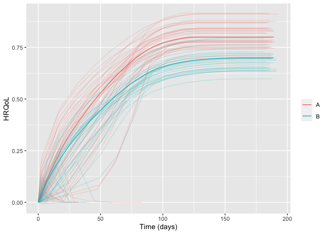

<!-- README.md is generated from README.Rmd. Please edit that file -->

# hrqolr 

<!-- badges: start -->

[](https://github.com/INCEPTdk/hrqolr/actions/workflows/R-CMD-check.yaml)
[](https://app.codecov.io/gh/INCEPTdk/hrqolr)
<!--  -->
<!-- badges: end -->

Package for simulating randomised clinical trials with temporal
trajectories of health-related quality of life (HRQoL) as the outcome,
to quantify effect sizes as single-sampled HRQoL values at end of
follow-up and as the area under the trajectories.

Developed as part of the INCEPT (Intensive Care Platform Trial) project
(<https://incept.dk/>), which is primarily supported by a grant from
Sygeforsikringen “danmark” (<https://www.sygeforsikring.dk/>).

## Resources

- [Website](https://inceptdk.github.io/hrqolr/index.html) - stand-alone
  website with full package documentation
- [Health-related quality of life trajectories in critical illness:
  protocol for a Monte Carlo simulation
  study](https://onlinelibrary.wiley.com/doi/10.1111/aas.14324) -
  protocol article in Acta Anaesthesiologica Scandinavica outlining the
  first scientific study to use `hrqolr`

## Getting started

First, load the package:

``` r
library(hrqolr)
#> Loading 'hrqolr' package v0.0.0.9021.
#> For help, run 'help("hrqolr")' or check out https://inceptdk.github.io/hrqolr.
```

The preferred way to design a scenario is by using the
`setup_scenario()` function to validate the input and give it the right
format. Set `verbose = FALSE` to silence the validation results.

``` r
scenario <- setup_scenario(
    arms = c("A", "B"),
    n_patients = 100,
    sampling_frequency = 14,
    index_hrqol = 0.0,
    first_hrqol = 0.1,
    final_hrqol = c(A = 0.8, B = 0.7),
    acceleration_hrqol = c(A = 1.1, B = 1.0),
    
    mortality = 0.4,
    mortality_dampening = 0.0,
    mortality_trajectory_shape = "exp_decay",
    prop_mortality_benefitters = 0.0,
)
#> Scenario-parameter validation:
#> - arms                         valid as is   c("A", "B")   
#> - n_patients                   expanded to   c(A = 100, B = 100)   
#> - index_hrqol                  expanded to   c(A = 0, B = 0)   
#> - first_hrqol                  expanded to   c(A = 0.1, B = 0.1)   
#> - final_hrqol                  valid as is   c(A = 0.8, B = 0.7)   
#> - acceleration_hrqol           valid as is   c(A = 1.1, B = 1)   
#> - mortality                    expanded to   c(A = 0.4, B = 0.4)   
#> - mortality_dampening          expanded to   c(A = 0, B = 0)   
#> - mortality_trajectory_shape   expanded to   c(A = "exp_decay", B = "exp_decay")   
#> - prop_mortality_benefitters   expanded to   c(A = 0, B = 0)   
#> - sampling_frequency           expanded to   c(A = 14, B = 14)
```

Getting an overview of the final scenario:

``` r
scenario
#> - arms                                    A           B
#> - n_patients                            100         100
#> - index_hrqol                             0           0
#> - first_hrqol                           0.1         0.1
#> - final_hrqol                           0.8         0.7
#> - acceleration_hrqol                    1.1           1
#> - mortality                             0.4         0.4
#> - mortality_dampening                     0           0
#> - mortality_trajectory_shape      exp_decay   exp_decay
#> - prop_mortality_benefitters              0           0
#> - sampling_frequency                     14          14
```

With the scenario at hand, we can sample a number of example
trajectories and visualise them:

``` r
example_trajs <- sample_example_trajectories(scenario, n_digits = 3)
plot(example_trajs)
```

<!-- -->

`sample_example_trajectories` returns a `ggplot` object, allowing you to
fine-tune its appearance for your needs. For example, breaking apart the
trajectories in the arms apart with facets and hide the legend (remember
to load `ggplot2` first). Here, we also set the arm-level trajectory in
black to make it stand out better:

``` r
library(ggplot2) 

plot(example_trajs, arm_aes = list(colour = "black")) +
    facet_wrap(~ arm) +
    theme(legend.position = "none")
```

<!-- -->

You can also summarise the trajectories, e.g., with inter-quartile
ranges. The ribbons become a bit wonky at end of follow-up due to
increasingly fewer observations some of which might be low:

``` r
plot(example_trajs, "summarise", ribbon_percentiles = c(0.25, 0.75))
```

<!-- -->

The same scenario specification can, then, be used to simulate a desired
number of trials. By default `hrqolr` will print progress updates to the
console (silence these with `verbose = FALSE`):

``` r
sims <- simulate_trials(scenario)
#> 2023-12-08 00:10:57: Estimating ground truth of arm 'A' (0 secs)
#> 2023-12-08 00:10:57: Starting arm 'A' (0.65 secs)
#> 2023-12-08 00:10:59: Estimating ground truth of arm 'B' (2.49 secs)
#> 2023-12-08 00:11:00: Starting arm 'B' (3.07 secs)
#> 2023-12-08 00:11:01: Aggregating results (4.8 secs)
#> 2023-12-08 00:11:02: Finished (5.07 secs)
#> 2023-12-08 00:11:02: Sampling example trajectories (5.37 secs)
#> 2023-12-08 00:11:02: Wrapping up, returning output (5.78 secs)
```

The returned object contains quite a lot of interesting information. For
example, summary statistics by arm:

``` r
sims$summary_stats
#>                      outcome arm  analysis    p25     p50     p75    mean    sd    se
#>  1:    primary__hrqol_at_eof   A       all  0.454   0.484   0.512   0.482 0.039 0.004
#>  2:    primary__hrqol_at_eof   B       all  0.396   0.418   0.438   0.416 0.036 0.004
#>  3:       primary__hrqol_auc   A       all 65.524  69.310  73.164  69.045 5.492 0.549
#>  4:       primary__hrqol_auc   B       all 57.170  60.289  63.167  59.997 5.169 0.517
#>  5: secondary1__hrqol_at_eof   A       all  0.454   0.484   0.512   0.482 0.039 0.004
#>  6: secondary1__hrqol_at_eof   B       all  0.396   0.418   0.438   0.416 0.036 0.004
#>  7:    secondary1__hrqol_auc   A       all 65.330  69.208  72.992  68.917 5.537 0.554
#>  8:    secondary1__hrqol_auc   B       all 56.985  60.002  62.866  59.780 5.201 0.520
#>  9: secondary2__hrqol_at_eof   A       all  0.457   0.484   0.512   0.482 0.039 0.004
#> 10: secondary2__hrqol_at_eof   B       all  0.396   0.418   0.438   0.416 0.036 0.004
#> 11:    secondary2__hrqol_auc   A       all 61.300  64.935  68.724  64.884 5.237 0.524
#> 12:    secondary2__hrqol_auc   B       all 53.425  56.452  59.183  56.038 4.916 0.492
#> 13:    primary__hrqol_at_eof   A survivors  0.562   0.580   0.606   0.581 0.037 0.004
#> 14:    primary__hrqol_at_eof   B survivors  0.482   0.505   0.522   0.501 0.034 0.003
#> 15:       primary__hrqol_auc   A survivors 80.721  83.140  86.545  83.264 5.096 0.510
#> 16:       primary__hrqol_auc   B survivors 69.305  72.786  75.463  72.297 4.797 0.480
#> 17: secondary1__hrqol_at_eof   A survivors  0.650   0.669   0.699   0.673 0.036 0.004
#> 18: secondary1__hrqol_at_eof   B survivors  0.561   0.584   0.610   0.583 0.033 0.003
#> 19:    secondary1__hrqol_auc   A survivors 92.751  95.909  99.937  96.299 5.123 0.512
#> 20:    secondary1__hrqol_auc   B survivors 80.721  83.795  87.400  83.848 4.825 0.483
#> 21: secondary2__hrqol_at_eof   A survivors  0.740   0.756   0.770   0.754 0.023 0.002
#> 22: secondary2__hrqol_at_eof   B survivors  0.646   0.663   0.682   0.663 0.023 0.002
#> 23:    secondary2__hrqol_auc   A survivors 99.595 101.765 103.754 101.512 3.072 0.307
#> 24:    secondary2__hrqol_auc   B survivors 86.993  89.424  91.520  89.280 3.206 0.321
#>                      outcome arm  analysis    p25     p50     p75    mean    sd    se
```

–and head-to-head comparisons between the arms:

``` r
sims$comparisons
#>                      statistic primary__hrqol_at_eof primary__hrqol_at_eof primary__hrqol_auc primary__hrqol_auc secondary1__hrqol_at_eof secondary1__hrqol_at_eof secondary1__hrqol_auc secondary1__hrqol_auc secondary2__hrqol_at_eof secondary2__hrqol_at_eof secondary2__hrqol_auc secondary2__hrqol_auc
#>  1:                 comparator                     A                     A                  A                  A                        A                        A                     A                     A                        A                        A                     A                     A
#>  2:                     target                     B                     B                  B                  B                        B                        B                     B                     B                        B                        B                     B                     B
#>  3:                   analysis                   all             survivors                all          survivors                      all                survivors                   all             survivors                      all                survivors                   all             survivors
#>  4:              mean_estimate                -0.066                 -0.08             -9.049            -10.967                   -0.066                    -0.09                -9.137               -12.451                   -0.066                   -0.092                -8.846               -12.233
#>  5:          mean_ground_truth                -0.051                -0.051             -6.892             -6.892                   -0.051                   -0.051                 -6.92                 -6.92                   -0.051                   -0.051                -6.849                -6.849
#>  6:                         sd                 0.053                 0.051              7.467              7.146                    0.053                    0.049                 7.551                 7.118                    0.053                    0.033                 7.133                 4.452
#>  7:                         se                 0.005                 0.005              0.747              0.715                    0.005                    0.005                 0.755                 0.712                    0.005                    0.003                 0.713                 0.445
#>  8:                       bias                -0.015                -0.029             -2.157             -4.075                   -0.015                   -0.039                -2.217                -5.531                   -0.016                   -0.041                -1.997                -5.384
#>  9:                    bias_se                 0.005                 0.005              0.747              0.715                    0.005                    0.005                 0.755                 0.712                    0.005                    0.003                 0.713                 0.445
#> 10:              relative_bias                 0.306                 0.582              0.313              0.591                    0.305                    0.779                  0.32                 0.799                    0.306                    0.807                 0.292                 0.786
#> 11:           relative_bias_se                 0.104                   0.1              0.108              0.104                    0.105                    0.097                 0.109                 0.103                    0.105                    0.064                 0.104                 0.065
#> 12:                        mse                 0.003                 0.003             59.851             67.163                    0.003                    0.004                61.359                80.752                    0.003                    0.003                54.354                48.605
#> 13:                     mse_se                     0                     0              8.089              9.572                        0                    0.001                 8.388                10.811                        0                        0                 7.326                 5.305
#> 14:                   coverage                  0.94                   0.9               0.95               0.92                     0.93                     0.83                  0.95                  0.85                     0.93                     0.73                  0.94                  0.75
#> 15:                coverage_se                 0.024                  0.03              0.022              0.027                    0.026                    0.038                 0.022                 0.036                    0.026                    0.044                 0.024                 0.043
#> 16:    bias_corrected_coverage                     1                     1                  1                  1                        1                        1                     1                     1                        1                        1                     1                     1
#> 17: bias_corrected_coverage_se                     0                     0                  0                  0                        0                        0                     0                     0                        0                        0                     0                     0
#> 18:       rejection_proportion                  0.21                  0.31               0.19               0.27                     0.21                     0.49                  0.19                  0.46                     0.21                      0.8                  0.22                  0.77
#> 19:    rejection_proportion_se                 0.041                 0.046              0.039              0.044                    0.041                     0.05                 0.039                  0.05                    0.041                     0.04                 0.041                 0.042
#> 20:                      n_sim                   100                   100                100                100                      100                      100                   100                   100                      100                      100                   100                   100
#> 21:                        p25                -0.098                -0.111            -13.493            -15.189                   -0.098                   -0.128               -13.647               -17.587                   -0.098                   -0.114               -13.126                -15.63
#> 22:                        p50                -0.071                 -0.08             -9.189            -11.245                   -0.072                   -0.087                -9.391               -12.255                   -0.072                   -0.093                -9.525               -12.312
#> 23:                        p75                -0.023                -0.045             -3.276             -6.505                   -0.023                   -0.055                -3.163                -7.614                   -0.027                   -0.066                -3.151                -8.883
#>                      statistic primary__hrqol_at_eof primary__hrqol_at_eof primary__hrqol_auc primary__hrqol_auc secondary1__hrqol_at_eof secondary1__hrqol_at_eof secondary1__hrqol_auc secondary1__hrqol_auc secondary2__hrqol_at_eof secondary2__hrqol_at_eof secondary2__hrqol_auc secondary2__hrqol_auc
```

## Installation

`hrqolr` isn’t on CRAN yet but can be installed from GitHub if you have
the `remotes` package installed:

``` r
# install.packages("remotes") 
remotes::install_github("INCEPTdk/hrqolr")
```

You can also install the **development version** from directly from
GitHub. Doing this requires the `remotes` package installed. The
development version may contain additional features not yet available in
the stable CRAN version, but may be unstable or lack documentation.

``` r
remotes::install_github("INCEPTdk/hrqolr@dev")
```

## Issues and enhancements

We use the [GitHub issue
tracker](https://github.com/INCEPTdk/hrqolr/issues) for all bug/issue
reports and proposals for enhancements.

## Contributing

We welcome contributions directly to the code to improve performance as
well as new functionality. For the latter, please first explain and
motivate it in an [issue](https://github.com/INCEPTdk/hrqolr/issues).

Changes to the code base should follow these steps:

- [Fork](https://docs.github.com/en/get-started/quickstart/fork-a-repo)
  the repository
- [Make a
  branch](https://docs.github.com/en/pull-requests/collaborating-with-pull-requests/proposing-changes-to-your-work-with-pull-requests/creating-and-deleting-branches-within-your-repository)
  with an appropriate name in your fork
- Implement changes in your fork, make sure it passes R CMD check (with
  neither errors, warnings, nor notes) and add a bullet at the top of
  NEWS.md with a short description of the change, your GitHub handle and
  the id of the pull request implementing the change (check the
  `NEWS.md` file to see the formatting)
- Create a [pull
  request](https://docs.github.com/en/pull-requests/collaborating-with-pull-requests/proposing-changes-to-your-work-with-pull-requests/creating-a-pull-request-from-a-fork)
  into the `dev` branch of `adaptr`

## Citation

If using `hrqolr`, please consider citing it:

``` r
citation(package = "hrqolr")
#> To cite package 'hrqolr' in publications use:
#> 
#>   Kaas-Hansen BS, Granholm A (2023). hrqolr: an R package for
#>   simulating health-related quality of life trajectories.
#>   https://inceptdk.github.io/hrqolr/
#> 
#> A BibTeX entry for LaTeX users is
#> 
#>   @Manual{,
#>     title = {{hrqolr}: an R package for simulating health-related quality of life trajectories},
#>     author = {Benjamin Skov Kaas-Hansen and Anders Granholm},
#>     year = {2023},
#>     url = {https://inceptdk.github.io/hrqolr/},
#>   }
```
