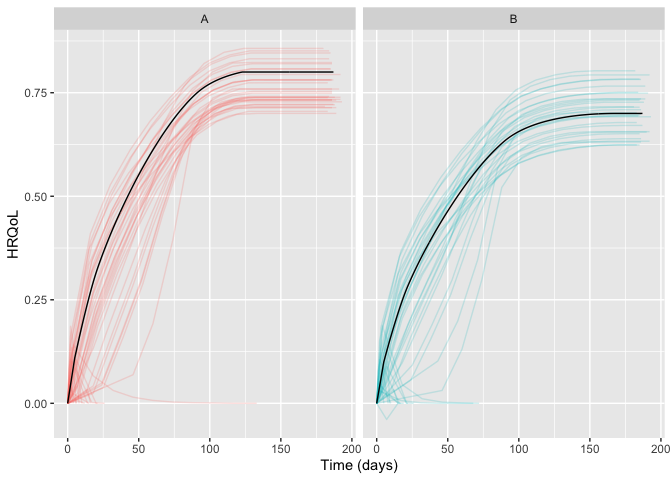
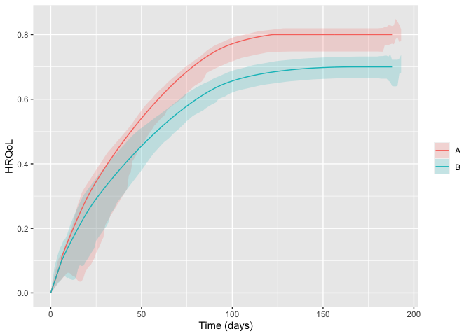

<!-- README.md is generated from README.Rmd. Please edit that file -->

# hrqolr 

<!-- badges: start -->

[](https://github.com/INCEPTdk/hrqolr/actions/workflows/R-CMD-check.yaml)
[](https://app.codecov.io/gh/INCEPTdk/hrqolr)
<!--  -->
<!-- badges: end -->

Package for simulating randomised clinical trials with temporal
trajectories of health-related quality of life (HRQoL) as the outcome,
to quantify effect sizes as single-sampled HRQoL values at end of
follow-up and as the area under the trajectories.

Developed as part of the INCEPT (Intensive Care Platform Trial) project
(<https://incept.dk/>), which is primarily supported by a grant from
Sygeforsikringen “danmark” (<https://www.sygeforsikring.dk/>).

## Resources

- [Website](https://inceptdk.github.io/hrqolr/index.html) - stand-alone
  website with full package documentation
- [Health-related quality of life trajectories in critical illness:
  protocol for a Monte Carlo simulation
  study](https://doi.org/10.1111/aas.14324) - article in Acta
  Anaesthesiologica Scandinavica outlining the first scientific study to
  use `hrqolr`

## Getting started

First, load the package:

``` r
library(hrqolr)
#> Loading 'hrqolr' package v0.0.0.9003.
#> For help, run 'help("hrqolr")' or check out https://inceptdk.github.io/hrqolr/.
#> Consider running 'cache_hrqolr()' for faster simulations. If you have enough RAM, 
#> increasing the cache size might speed up things even more; run '?cache_hrqolr' for details.
```

–then, we activate the cache; although optional, it’s highly
recommended. Here, we choose a cache of max. 2 GB of memory
($2 \cdot 1024^3$ bytes)–`hrqolr` currently only allows in-memory
caching.

``` r
cache_hrqolr(2 * 1024^3)
```

The preferred way to design a scenario is by using the `setup_scenario`
function to validate the input and give it the right format. Set
`verbose = FALSE` to silence the validation results.

``` r
scenario <- setup_scenario(
    arms = c("A", "B"),
    n_patients = 100,
    sampling_frequency = 14,
    index_hrqol = 0.0,
    first_hrqol = 0.1,
    final_hrqol = c(A = 0.8, B = 0.7),
    acceleration_hrqol = c(A = 0.1, B = 0.0),
    
    mortality = 0.4,
    mortality_dampening = 0.0,
    mortality_trajectory_shape = "exp_decay",
    prop_mortality_benefitters = 0.0,
)
#> arms                         valid as is      
#> n_patients                   modified      100 --> c("A" = 100, "B" = 100)   
#> index_hrqol                  modified      0 --> c("A" = 0, "B" = 0)   
#> first_hrqol                  modified      0.1 --> c("A" = 0.1, "B" = 0.1)   
#> final_hrqol                  valid as is      
#> acceleration_hrqol           valid as is      
#> mortality                    modified      0.4 --> c("A" = 0.4, "B" = 0.4)   
#> mortality_dampening          modified      0 --> c("A" = 0, "B" = 0)   
#> mortality_trajectory_shape   modified      "exp_decay" --> c("A" = "exp_decay", "B" = "exp_decay")   
#> prop_mortality_benefitters   modified      0 --> c("A" = 0, "B" = 0)   
#> sampling_frequency           modified      14 --> c("A" = 14, "B" = 14)
```

Getting an overview of the final scenario:

``` r
scenario
#> arms                                    A           B
#> n_patients                            100         100
#> index_hrqol                             0           0
#> first_hrqol                           0.1         0.1
#> final_hrqol                           0.8         0.7
#> acceleration_hrqol                    0.1           0
#> mortality                             0.4         0.4
#> mortality_dampening                     0           0
#> mortality_trajectory_shape      exp_decay   exp_decay
#> prop_mortality_benefitters              0           0
#> sampling_frequency                     14          14
```

With the scenario at hand, we can sample a number of example
trajectories and visualise them:

``` r
example_trajs <- sample_example_trajectories(scenario, n_digits = 3)
plot(example_trajs)
```

<!-- -->

`sample_example_trajectories` returns a `ggplot`, allowing you to
fine-tune its appearance for your needs. For example, breaking apart the
trajectories in the arms apart with facets and hide the legend (remember
to load `ggplot2` first). Here, we also set the arm-level trajectory in
black to make it stand out better:

``` r
library(ggplot2) 

plot(example_trajs, arm_aes = list(colour = "black")) +
    facet_wrap(~ arm) +
    theme(legend.position = "none")
```

<!-- -->

You can also summarise the trajectories, e.g., with inter-quartile
ranges. The ribbons become a bit wonky at end of follow-up due to
increasingly few observations some of which might be low:

``` r
plot(example_trajs, "summarise", ribbon_percentiles = c(0.25, 0.75))
```

<!-- -->

The same scenario specification can, then, be used to simulate a desired
number of trials. By default `hrqolr` will print progress updates to the
console (silence these with `verbose = FALSE`):

``` r
sims <- simulate_trials(scenario)
#> 2023-10-16 09:43:58: Estimating ground truth of arm 'A' (0 secs)
#> 2023-10-16 09:44:00: Starting arm 'A' (2.14 secs)
#> 2023-10-16 09:44:07: Estimating ground truth of arm 'B' (8.76 secs)
#> 2023-10-16 09:44:09: Starting arm 'B' (1.58 secs)
#> 2023-10-16 09:44:17: Finished (10.04 secs)
#> 2023-10-16 09:44:18: Sampling example trajectories (19.4 secs)
#> 2023-10-16 09:44:18: Wrapping up, returning output (19.53 secs)
```

The returned object contains quite a lot of interesting information. For
example, summary statistics by arm:

``` r
sims$summary_stats
#>                      outcome arm  analysis     p25     p50     p75    mean    sd    se
#>  1:    primary__hrqol_at_eof   A       all   0.446   0.470   0.499   0.471 0.041 0.004
#>  2:    primary__hrqol_at_eof   B       all   0.395   0.418   0.445   0.417 0.034 0.003
#>  3:       primary__hrqol_auc   A       all  65.372  69.162  72.882  68.964 5.989 0.599
#>  4:       primary__hrqol_auc   B       all  56.788  59.970  64.224  60.025 4.951 0.495
#>  5: secondary1__hrqol_at_eof   A       all   0.446   0.470   0.499   0.471 0.041 0.004
#>  6: secondary1__hrqol_at_eof   B       all   0.395   0.418   0.445   0.417 0.034 0.003
#>  7:    secondary1__hrqol_auc   A       all  65.252  69.030  72.785  68.867 6.016 0.602
#>  8:    secondary1__hrqol_auc   B       all  56.545  59.726  64.024  59.820 4.943 0.494
#>  9: secondary2__hrqol_at_eof   A       all   0.446   0.470   0.499   0.471 0.041 0.004
#> 10: secondary2__hrqol_at_eof   B       all   0.395   0.418   0.445   0.417 0.034 0.003
#> 11:    secondary2__hrqol_auc   A       all  61.203  64.611  68.158  64.590 5.649 0.565
#> 12:    secondary2__hrqol_auc   B       all  53.155  56.237  59.908  56.144 4.564 0.456
#> 13:    primary__hrqol_at_eof   A survivors   0.555   0.580   0.605   0.577 0.042 0.004
#> 14:    primary__hrqol_at_eof   B survivors   0.496   0.521   0.534   0.517 0.032 0.003
#> 15:       primary__hrqol_auc   A survivors  81.189  84.817  88.232  84.512 6.108 0.611
#> 16:       primary__hrqol_auc   B survivors  71.207  74.789  76.792  74.287 4.676 0.468
#> 17: secondary1__hrqol_at_eof   A survivors   0.669   0.686   0.708   0.686 0.029 0.003
#> 18: secondary1__hrqol_at_eof   B survivors   0.591   0.611   0.625   0.609 0.029 0.003
#> 19:    secondary1__hrqol_auc   A survivors  98.197 100.593 103.403 100.289 4.382 0.438
#> 20:    secondary1__hrqol_auc   B survivors  84.871  87.641  89.682  87.250 4.230 0.423
#> 21: secondary2__hrqol_at_eof   A survivors   0.782   0.788   0.794   0.786 0.010 0.001
#> 22: secondary2__hrqol_at_eof   B survivors   0.686   0.695   0.700   0.693 0.009 0.001
#> 23:    secondary2__hrqol_auc   A survivors 107.306 108.095 108.819 107.869 1.475 0.147
#> 24:    secondary2__hrqol_auc   B survivors  92.435  93.341  94.267  93.245 1.392 0.139
#>                      outcome arm  analysis     p25     p50     p75    mean    sd    se
```

–and head-to-head comparisons between the arms:

``` r
sims$comparisons
#>                      statistic primary__hrqol_at_eof primary__hrqol_at_eof primary__hrqol_auc primary__hrqol_auc secondary1__hrqol_at_eof secondary1__hrqol_at_eof secondary1__hrqol_auc secondary1__hrqol_auc secondary2__hrqol_at_eof secondary2__hrqol_at_eof secondary2__hrqol_auc secondary2__hrqol_auc
#>  1:                 comparator                     A                     A                  A                  A                        A                        A                     A                     A                        A                        A                     A                     A
#>  2:                     target                     B                     B                  B                  B                        B                        B                     B                     B                        B                        B                     B                     B
#>  3:              mean_estimate                -0.053                 -0.06             -8.938            -10.225                   -0.053                   -0.077                -9.047                -13.04                   -0.053                   -0.093                -8.446               -14.624
#>  4:          mean_ground_truth                 -0.05                 -0.05             -8.211             -8.211                    -0.05                    -0.05                -8.348                -8.348                    -0.05                    -0.05                -7.819                -7.819
#>  5:                         sd                 0.058                 0.055              8.339              7.951                    0.058                    0.042                 8.368                 6.175                    0.058                    0.013                 7.868                  1.89
#>  6:                         se                 0.006                 0.005              0.834              0.795                    0.006                    0.004                 0.837                 0.617                    0.006                    0.001                 0.787                 0.189
#>  7:                   analysis                   all             survivors                all          survivors                      all                survivors                   all             survivors                      all                survivors                   all             survivors
#>  8:                       bias                -0.003                 -0.01             -0.728             -2.015                   -0.003                   -0.027                -0.699                -4.691                   -0.003                   -0.043                -0.628                -6.806
#>  9:                    bias_se                 0.006                 0.005              0.834              0.795                    0.006                    0.004                 0.837                 0.617                    0.006                    0.001                 0.787                 0.189
#> 10:              relative_bias                 0.065                 0.203              0.089              0.245                    0.064                     0.53                 0.084                 0.562                    0.064                    0.854                  0.08                  0.87
#> 11:           relative_bias_se                 0.115                 0.109              0.102              0.097                    0.115                    0.083                   0.1                 0.074                    0.115                    0.026                 0.101                 0.024
#> 12:                        mse                 0.003                 0.003             69.379             66.645                    0.003                    0.002                69.804                59.758                    0.003                    0.002                61.675                 49.85
#> 13:                     mse_se                     0                     0              8.332              8.327                        0                        0                  8.39                 7.569                        0                        0                  7.31                 2.552
#> 14:                   coverage                  0.91                  0.96               0.91               0.94                     0.91                     0.91                  0.92                  0.91                     0.91                     0.17                  0.91                  0.13
#> 15:                coverage_se                 0.029                  0.02              0.029              0.024                    0.029                    0.029                 0.027                 0.029                    0.029                    0.038                 0.029                 0.034
#> 16:    bias_corrected_coverage                  0.91                  0.95               0.92               0.94                     0.91                     0.96                  0.91                  0.97                     0.91                        1                  0.91                     1
#> 17: bias_corrected_coverage_se                 0.029                 0.022              0.027              0.024                    0.029                     0.02                 0.029                 0.017                    0.029                        0                 0.029                     0
#> 18:       rejection_proportion                  0.22                  0.25               0.24               0.27                     0.22                     0.38                  0.24                  0.53                     0.22                        1                  0.25                     1
#> 19:    rejection_proportion_se                 0.041                 0.043              0.043              0.044                    0.041                    0.049                 0.043                  0.05                    0.041                        0                 0.043                     0
#> 20:                      n_sim                   100                   100                100                100                      100                      100                   100                   100                      100                      100                   100                   100
#> 21:                        p25                -0.088                  -0.1            -13.834            -15.934                   -0.088                   -0.104               -14.037               -17.012                   -0.088                   -0.101                -12.94               -15.824
#> 22:                        p50                -0.055                -0.058             -9.236            -10.306                   -0.053                   -0.077                -9.315               -13.129                   -0.053                   -0.094                -8.512               -14.583
#> 23:                        p75                 -0.01                -0.029             -3.001             -5.914                    -0.01                   -0.049                -2.925                -9.431                    -0.01                   -0.085                -2.738               -13.588
#>                      statistic primary__hrqol_at_eof primary__hrqol_at_eof primary__hrqol_auc primary__hrqol_auc secondary1__hrqol_at_eof secondary1__hrqol_at_eof secondary1__hrqol_auc secondary1__hrqol_auc secondary2__hrqol_at_eof secondary2__hrqol_at_eof secondary2__hrqol_auc secondary2__hrqol_auc
```

## Installation

`hrqolr` isn’t on CRAN yet but can be installed from GitHub if you have
the `remotes` package installed:

``` r
# install.packages("remotes") 
remotes::install_github("INCEPTdk/hrqolr")
```

You can also install the **development version** from directly from
GitHub. Doing this requires the *remotes*-package installed. The
development version may contain additional features not yet available in
the stable CRAN version, but may be unstable or lack documentation.

``` r
remotes::install_github("INCEPTdk/hrqolr@dev")
```

## Issues and enhancements

We use the [GitHub issue
tracker](https://github.com/INCEPTdk/hrqolr/issues) for all bug/issue
reports and proposals for enhancements.

## Contributing

We welcome contributions directly to the code to improve performance as
well as new functionality. For the latter, please first explain and
motivate it in an [issue](https://github.com/INCEPTdk/hrqolr/issues).

Changes to the code base should follow these steps:

- [Fork](https://docs.github.com/en/get-started/quickstart/fork-a-repo)
  the repository
- [Make a
  branch](https://docs.github.com/en/pull-requests/collaborating-with-pull-requests/proposing-changes-to-your-work-with-pull-requests/creating-and-deleting-branches-within-your-repository)
  with an appropriate name in your fork
- Implement changes in your fork, make sure it passes R CMD check (with
  neither errors, warnings, nor notes) and add a bullet at the top of
  NEWS.md with a short description of the change, your GitHub handle and
  the id of the pull request implementing the change (check the
  `NEWS.md` file to see the formatting)
- Create a [pull
  request](https://docs.github.com/en/pull-requests/collaborating-with-pull-requests/proposing-changes-to-your-work-with-pull-requests/creating-a-pull-request-from-a-fork)
  into the `dev` branch of `adaptr`

## Citation

If using `hrqolr`, please consider citing it:

``` r
citation(package = "hrqolr")
#> To cite package 'hrqolr' in publications use:
#> 
#>   Kaas-Hansen BS, Granholm A (2023). hrqolr: an R package for
#>   simulating health-related quality of life trajectories.
#>   https://inceptdk.github.io/hrqolr/
#> 
#> A BibTeX entry for LaTeX users is
#> 
#>   @Manual{,
#>     title = {{hrqolr}: an R package for simulating health-related quality of life trajectories},
#>     author = {Benjamin Skov Kaas-Hansen and Anders Granholm},
#>     year = {2023},
#>     url = {https://inceptdk.github.io/hrqolr/},
#>   }
```
