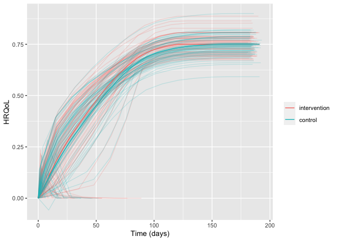

<!-- README.md is generated from README.Rmd. Please edit that file -->

# hrqolr 

<!-- badges: start -->

[](https://github.com/epiben/hrqolr/actions/workflows/R-CMD-check.yaml)
<!-- [](https://app.codecov.io/gh/INCEPTdk/adaptr/)
 -->
<!-- badges: end -->

Package for simulating two-arm randomised clinical trials with temporal
trajectories of health-related quality of life (HRQoL) as the outcome
and quantifies effect sizes as single-sampled HRQoL values at end of
follow-up and as the area under the trajectories.

Developed as part of the INCEPT (Intensive Care Platform Trial) project
(<https://incept.dk/>), which is primarily supported by a grant from
Sygeforsikringen “danmark” (<https://www.sygeforsikring.dk/>).

## Resources

- [Website](https://inceptdk.github.io/hrqolr/index.html) - stand-alone
  website with full package documentation
- [Health-related quality of life trajectories in critical illness:
  protocol for a Monte Carlo simulation
  study](https://doi.org/10.1111/aas.14324) - article in Acta
  Anaesthesiologica Scandinavica outlining the first scientific study to
  use `hrqolr`

## Installation

The easiest way is to install from CRAN directly:

``` r
install.packages("hrqolr")
```

You can also install the **development version** from directly from
GitHub. Doing this requires the *remotes*-package installed. The
development version may contain additional features not yet available in
the stable CRAN version, but may be unstable or lack documentation.

``` r
# install.packages("remotes") 
remotes::install_github("INCEPTdk/hrqolr@dev")
```

## Example

`hrqolr` was built to simulate many scenarios.

``` r
library(hrqolr)
#> Loading 'hrqolr' package v0.1.0.
#> For help, run 'help("hrqolr")' or 
#> check out https://inceptdk.github.io/hrqolr/.
#> Consider running 'cache_hrqolr()' for faster simulations. 
#> If you have enough RAM, consider increasing the cache size; 
#> run '?cache_hrqolr' for details.
cache_hrqolr()

scenario <- list(
    n_trials = 100L,
    n_patients_per_arm = 100L,
    
    start_hrqol_ctrl = 0.1,
    final_hrqol_ctrl = 0.75,
    relative_improvement_final_hrqol_actv = 0.0,
    sampling_frequency = 14L,
    acceleration_hrqol_actv = 0.1,
    
    mortality_ctrl = 0.4,
    relative_mortality_reduction_actv = 0.0,
    mortality_dampening = 0.0,
    mortality_trajectory_shape = "exp_decay",
    prop_mortality_benefitters_actv = 0.0,
    
    n_digits = 3,
    n_patients_ground_truth = 1000L,
    n_example_trajectories_per_arm = 100L
)

example_trajs <- do.call(sample_example_trajectories, scenario)
example_trajs
#> $arm_level
#>               arm          x         y
#>   1: intervention   0.000000 0.0000000
#>   2: intervention   9.000000 0.1000000
#>   3: intervention   9.007835 0.1100861
#>   4: intervention   9.022878 0.1102224
#>   5: intervention   9.045034 0.1104414
#>  ---                                  
#> 594:      control 190.582005 0.7500000
#> 595:      control 190.748687 0.7500000
#> 596:      control 190.874375 0.7500000
#> 597:      control 190.958377 0.7500000
#> 598:      control 191.000000 0.7500000
#> 
#> $patient_level
#>                arm  id   x     y
#>    1: intervention   1   0 0.000
#>    2: intervention   1   3 0.156
#>    3: intervention   1   4 0.000
#>    4: intervention   2   0 0.000
#>    5: intervention   2  10    NA
#>   ---                           
#> 2038:      control 199 189 0.756
#> 2039:      control 200   0 0.000
#> 2040:      control 200   2 0.059
#> 2041:      control 200  16 0.000
#> 2042:      control 200  20 0.000
#> 
#> attr(,"class")
#> [1] "hrqolr_trajectories" "list"
```

### Visualise trajectories

``` r
plot(example_trajs)
```



You might also want to break apart the trajectories in the arms. Hiding
the legend, then, makes sense as the facet strips will already provide
the same information. Here, we also set the arm-level trajectory in
black to set it apart from the individual patient trajectories:

``` r
library(ggplot2) 

plot(example_trajs, arm_aes = list(colour = "black")) +
    facet_wrap(~ arm) +
    theme(legend.position = "none")
```


Of course, we might also be interested in summarising the trajectories.
Here, for example, with inter-quartile range. Note that the ribbons
become a bit wonky at end of follow-up because there are increasingly
few observations, and some of them may be low because, e.g., *mortality
benefitters* are still alive.

``` r
plot(example_trajs, "summarise", ribbon_percentiles = c(0.25, 0.75))
```


The same scenario specification can, then, be used to simulate a desired
number of trials:

``` r
sims <- do.call(simulate_trials, scenario)
#> 2023-09-29 22:32:13: STARTING BATCH 1 (0 secs)
#> 2023-09-29 22:32:13: Estimating ground truth of arm actv (0.01 secs)
#> 2023-09-29 22:32:26: Finished actv arm in batch (12.12 secs)
#> 2023-09-29 22:32:26: Estimating ground truth of arm ctrl (12.12 secs)
#> 2023-09-29 22:32:37: Finished ctrl arm in batch (11.45 secs)
#> 2023-09-29 22:32:37: Finished batch (11.78 secs)
#> 2023-09-29 22:32:38: Combining data into final return struct (24.07 secs)
#> 2023-09-29 22:32:38: Wrapping up, returning output (24.1 secs)
sims
#> $summary_stats
#>                                  outcome          arm        mean         p25
#>  1:    surv__primary__hrqol_at_eof__mean intervention   0.5363629   0.5180439
#>  2:    surv__primary__hrqol_at_eof__mean      control   0.5436186   0.5250157
#>  3:       surv__primary__hrqol_auc__mean intervention  78.6739450  75.7291399
#>  4:       surv__primary__hrqol_auc__mean      control  78.1052664  75.1811988
#>  5: surv__secondary1__hrqol_at_eof__mean intervention   0.6361485   0.6137020
#>  6: surv__secondary1__hrqol_at_eof__mean      control   0.6447538   0.6219722
#>  7:    surv__secondary1__hrqol_auc__mean intervention  93.1917532  90.1781333
#>  8:    surv__secondary1__hrqol_auc__mean      control  92.3883222  89.3774531
#>  9: surv__secondary2__hrqol_at_eof__mean intervention   0.7347596   0.7309086
#> 10: surv__secondary2__hrqol_at_eof__mean      control   0.7446996   0.7407697
#> 11:    surv__secondary2__hrqol_auc__mean intervention 100.8029468 100.0206638
#> 12:    surv__secondary2__hrqol_auc__mean      control 100.3282820  99.5402182
#> 13:     all__primary__hrqol_at_eof__mean intervention   0.4349474   0.4038075
#> 14:     all__primary__hrqol_at_eof__mean      control   0.4408314   0.4093075
#> 15:        all__primary__hrqol_auc__mean intervention  63.8011554  59.4058002
#> 16:        all__primary__hrqol_auc__mean      control  63.3397780  58.9523711
#> 17:  all__secondary1__hrqol_at_eof__mean intervention   0.4350250   0.4038075
#> 18:  all__secondary1__hrqol_at_eof__mean      control   0.4409100   0.4093075
#> 19:     all__secondary1__hrqol_auc__mean intervention  63.7307650  59.3082761
#> 20:     all__secondary1__hrqol_auc__mean      control  63.1810940  58.7902536
#> 21:  all__secondary2__hrqol_at_eof__mean intervention   0.4350250   0.4038075
#> 22:  all__secondary2__hrqol_at_eof__mean      control   0.4409100   0.4093075
#> 23:     all__secondary2__hrqol_auc__mean intervention  59.6803108  55.1923682
#> 24:     all__secondary2__hrqol_auc__mean      control  59.3992286  54.9363650
#>                                  outcome          arm        mean         p25
#>             p50         p75          sd           se
#>  1:   0.5378694   0.5649285 0.038368805 0.0038368805
#>  2:   0.5451308   0.5725293 0.038875801 0.0038875801
#>  3:  78.7370355  82.5499391 5.640287968 0.5640287968
#>  4:  78.1600141  81.9473627 5.598226080 0.5598226080
#>  5:   0.6381614   0.6555895 0.030252419 0.0030252419
#>  6:   0.6467935   0.6643916 0.030636807 0.0030636807
#>  7:  93.0348663  95.8695896 4.536845003 0.4536845003
#>  8:  92.2908923  95.0342591 4.499531724 0.4499531724
#>  9:   0.7350565   0.7398001 0.008325213 0.0008325213
#> 10:   0.7450565   0.7498001 0.008391762 0.0008391762
#> 11: 100.9365647 101.6080603 1.260308655 0.1260308655
#> 12: 100.4613556 101.1290890 1.255960397 0.1255960397
#> 13:   0.4350900   0.4636600 0.036942242 0.0036942242
#> 14:   0.4409900   0.4698900 0.037436543 0.0037436543
#> 15:  63.8060768  68.0960443 5.461966473 0.5461966473
#> 16:  63.3256063  67.5938003 5.419147247 0.5419147247
#> 17:   0.4350900   0.4636600 0.036813658 0.0036813658
#> 18:   0.4409900   0.4698900 0.037306248 0.0037306248
#> 19:  63.6956264  68.0591989 5.460269005 0.5460269005
#> 20:  63.1506977  67.4808441 5.411327893 0.5411327893
#> 21:   0.4350900   0.4636600 0.036813658 0.0036813658
#> 22:   0.4409900   0.4698900 0.037306248 0.0037306248
#> 23:  59.6927726  63.7065086 5.044316436 0.5044316436
#> 24:  59.4120469  63.4006617 5.020074136 0.5020074136
#>             p50         p75          sd           se
#> 
#> $comparisons
#>                            outcome         mean mean_ground_truth           sd
#>  1:    surv__primary__hrqol_at_eof -0.007255676      -0.032463362 5.102650e-04
#>  2:       surv__primary__hrqol_auc  0.568678594      -3.427828929 5.062304e-02
#>  3: surv__secondary1__hrqol_at_eof -0.008605298      -0.014425307 3.897969e-04
#>  4:    surv__secondary1__hrqol_auc  0.803430982      -0.475974463 4.511705e-02
#>  5: surv__secondary2__hrqol_at_eof -0.009940054      -0.007674645 9.296047e-05
#>  6:    surv__secondary2__hrqol_auc  0.474664850       0.150302836 1.750253e-02
#>  7:     all__primary__hrqol_at_eof -0.005884000      -0.031188000 4.965985e-04
#>  8:        all__primary__hrqol_auc  0.461377320      -3.484177734 4.842485e-02
#>  9:  all__secondary1__hrqol_at_eof -0.005885000      -0.030474000 4.948982e-04
#> 10:     all__secondary1__hrqol_auc  0.549671032      -3.307522503 5.180743e-02
#> 11:  all__secondary2__hrqol_at_eof -0.005885000      -0.030474000 4.948982e-04
#> 12:     all__secondary2__hrqol_auc  0.281082149      -3.430510836 2.619489e-02
#>               se         bias bias_corrected_coverage
#>  1: 5.102650e-05  0.025207687                       1
#>  2: 5.062304e-03  3.996507524                       1
#>  3: 3.897969e-05  0.005820009                       1
#>  4: 4.511705e-03  1.279405446                       1
#>  5: 9.296047e-06 -0.002265409                       1
#>  6: 1.750253e-03  0.324362015                       1
#>  7: 4.965985e-05  0.025304000                       1
#>  8: 4.842485e-03  3.945555054                       1
#>  9: 4.948982e-05  0.024589000                       1
#> 10: 5.180743e-03  3.857193535                       1
#> 11: 4.948982e-05  0.024589000                       1
#> 12: 2.619489e-03  3.711592986                       1
#>     bias_corrected_coverage_se      bias_se coverage coverage_se          mse
#>  1:                          0 5.102650e-05        1           0 6.356852e-04
#>  2:                          0 5.062304e-03        1           0 1.597461e+01
#>  3:                          0 3.897969e-05        1           0 3.402292e-05
#>  4:                          0 4.511705e-03        1           0 1.638893e+00
#>  5:                          0 9.296047e-06        1           0 5.140631e-06
#>  6:                          0 1.750253e-03        1           0 1.055140e-01
#>  7:                          0 4.965985e-05        1           0 6.405366e-04
#>  8:                          0 4.842485e-03        1           0 1.556973e+01
#>  9:                          0 4.948982e-05        1           0 6.048614e-04
#> 10:                          0 5.180743e-03        1           0 1.488060e+01
#> 11:                          0 4.948982e-05        1           0 6.048614e-04
#> 12:                          0 2.619489e-03        1           0 1.377660e+01
#>           mse_se n_sim          p25          p50          p75
#>  1: 2.581155e-06   100 -0.007597533 -0.007272727 -0.006971836
#>  2: 4.033858e-02   100  0.541569003  0.569016907  0.605626993
#>  3: 4.528374e-07   100 -0.008873239 -0.008642506 -0.008326923
#>  4: 1.153228e-02   100  0.776209726  0.803571104  0.831226660
#>  5: 4.105549e-08   100 -0.010000000 -0.010000000 -0.009841270
#>  6: 1.121230e-03   100  0.464162632  0.476716450  0.486870779
#>  7: 2.519071e-06   100 -0.006300000 -0.005900000 -0.005500000
#>  8: 3.815105e-02   100  0.430383558  0.466298588  0.501366554
#>  9: 2.439440e-06   100 -0.006300000 -0.005900000 -0.005500000
#> 10: 3.988587e-02   100  0.521086035  0.551357547  0.592534980
#> 11: 2.439440e-06   100 -0.006300000 -0.005900000 -0.005500000
#> 12: 1.942701e-02   100  0.264706686  0.282819463  0.300313246
#>     rejection_proportion rejection_proportion_se relative_bias relative_bias_se
#>  1:                    0                       0    -0.7764965     0.0015718181
#>  2:                    0                       0    -1.1659005     0.0014768253
#>  3:                    0                       0    -0.4034582     0.0027021740
#>  4:                    0                       0    -2.6879708     0.0094788803
#>  5:                    0                       0     0.2951809     0.0012112673
#>  6:                    0                       0     2.1580565     0.0116448438
#>  7:                    0                       0    -0.8113377     0.0015922744
#>  8:                    0                       0    -1.1324207     0.0013898502
#>  9:                    0                       0    -0.8068846     0.0016240015
#> 10:                    0                       0    -1.1661881     0.0015663515
#> 11:                    0                       0    -0.8068846     0.0016240015
#> 12:                    0                       0    -1.0819359     0.0007635858
#> 
#> $args
#> $args$n_trials
#> [1] 100
#> 
#> $args$n_patients_per_arm
#> [1] 100
#> 
#> $args$start_hrqol_ctrl
#> [1] 0.1
#> 
#> $args$final_hrqol_ctrl
#> [1] 0.75
#> 
#> $args$relative_improvement_start_hrqol_actv
#> [1] 0
#> 
#> $args$relative_improvement_final_hrqol_actv
#> [1] 0
#> 
#> $args$sampling_frequency
#> [1] 14
#> 
#> $args$acceleration_hrqol_actv
#> [1] 0.1
#> 
#> $args$mortality_ctrl
#> [1] 0.4
#> 
#> $args$relative_mortality_reduction_actv
#> [1] 0
#> 
#> $args$mortality_dampening
#> [1] 0
#> 
#> $args$mortality_trajectory_shape
#> [1] "exp_decay"
#> 
#> $args$prop_mortality_benefitters_actv
#> [1] 0
#> 
#> $args$verbose
#> [1] TRUE
#> 
#> $args$n_digits
#> [1] 3
#> 
#> $args$seed
#> [1] 1028563912
#> 
#> $args$n_patients_ground_truth
#> [1] 1000
#> 
#> $args$n_example_trajectories_per_arm
#> [1] 100
#> 
#> $args$...
#> 
#> 
#> 
#> $elapsed_time
#> Time difference of 24.10509 secs
#> 
#> $example_trajectories
#> $arm_level
#>               arm         x         y
#>   1: intervention   0.00000 0.0000000
#>   2: intervention  12.00000 0.1000000
#>   3: intervention  12.00827 0.1100856
#>   4: intervention  12.02421 0.1102203
#>   5: intervention  12.04771 0.1104366
#>  ---                                 
#> 594:      control 179.62914 0.7500000
#> 595:      control 179.77697 0.7500000
#> 596:      control 179.88847 0.7500000
#> 597:      control 179.96301 0.7500000
#> 598:      control 180.00000 0.7500000
#> 
#> $patient_level
#>                arm  id   x         y
#>    1: intervention   1   0 0.0000000
#>    2: intervention   1   2 0.0740000
#>    3: intervention   1  16 0.3145785
#>    4: intervention   1  30 0.4242271
#>    5: intervention   1  44 0.5026606
#>   ---                               
#> 1915:      control 200 134 0.7298478
#> 1916:      control 200 148 0.7360000
#> 1917:      control 200 162 0.7380000
#> 1918:      control 200 176 0.7380000
#> 1919:      control 200 190 0.7380000
#> 
#> attr(,"class")
#> [1] "hrqolr_trajectories" "list"               
#> 
#> attr(,"class")
#> [1] "hrqolr_results" "list"
```

## Issues and enhancements

We use the [GitHub issue
tracker](https://github.com/epiben/hrqolr/issues) for all bug/issue
reports and proposals for enhancements.

## Contributing

We welcome contributions directly to the code to improve performance as
well as new functionality. For the latter, please first explain and
motivate it in an [issue](https://github.com/epiben/hrqolr/issues).

Changes to the code base should follow these steps:

- [Fork](https://docs.github.com/en/get-started/quickstart/fork-a-repo)
  the repository
- [Make a
  branch](https://docs.github.com/en/pull-requests/collaborating-with-pull-requests/proposing-changes-to-your-work-with-pull-requests/creating-and-deleting-branches-within-your-repository)
  with an appropriate name in your fork
- Implement changes in your fork, make sure it passes R CMD check (with
  neither errors, warnings, nor notes) and add a bullet at the top of
  NEWS.md with a short description of the change, your GitHub handle and
  the id of the pull request implementing the change (check the
  `NEWS.md` file to see the formatting)
- Create a [pull
  request](https://docs.github.com/en/pull-requests/collaborating-with-pull-requests/proposing-changes-to-your-work-with-pull-requests/creating-a-pull-request-from-a-fork)
  into the `dev` branch of `adaptr`

## Citation

If using the package, please consider citing it:

``` r
citation(package = "hrqolr")
#> To cite package 'hrqolr' in publications use:
#> 
#>   it Ww (2023). _hrqolr: What the Package Does (Title Case)_. R package
#>   version 0.1.0, <https://epiben.github.io/hrqolr/>.
#> 
#> A BibTeX entry for LaTeX users is
#> 
#>   @Manual{,
#>     title = {hrqolr: What the Package Does (Title Case)},
#>     author = {Who wrote it},
#>     year = {2023},
#>     note = {R package version 0.1.0},
#>     url = {https://epiben.github.io/hrqolr/},
#>   }
#> 
#> ATTENTION: This citation information has been auto-generated from the
#> package DESCRIPTION file and may need manual editing, see
#> 'help("citation")'.
```
