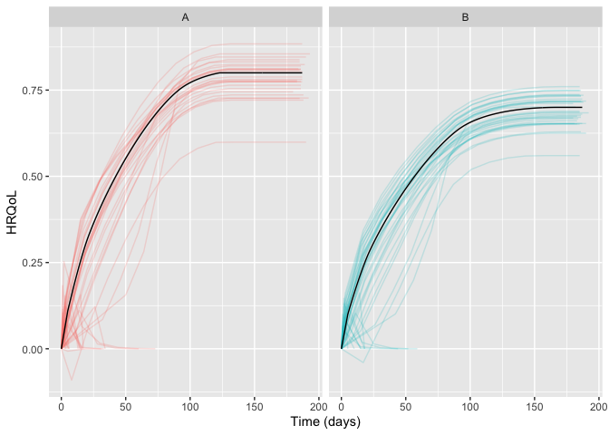
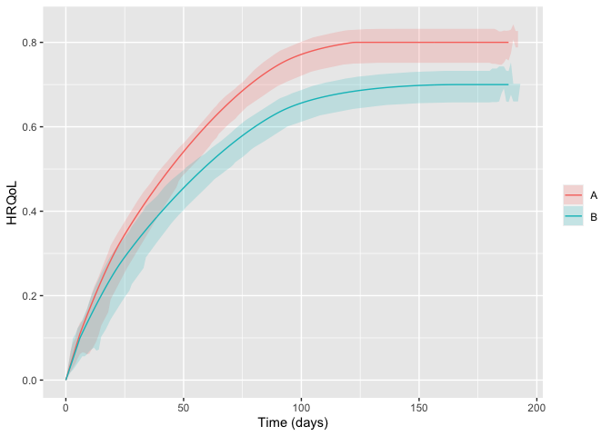

<!-- README.md is generated from README.Rmd. Please edit that file -->

# hrqolr 

<!-- badges: start -->

[](https://github.com/epiben/hrqolr/actions/workflows/R-CMD-check.yaml)
[](https://app.codecov.io/gh/INCEPTdk/hrqolr)
<!--  -->
<!-- badges: end -->

Package for simulating two-arm randomised clinical trials with temporal
trajectories of health-related quality of life (HRQoL) as the outcome
and quantifies effect sizes as single-sampled HRQoL values at end of
follow-up and as the area under the trajectories.

Developed as part of the INCEPT (Intensive Care Platform Trial) project
(<https://incept.dk/>), which is primarily supported by a grant from
Sygeforsikringen “danmark” (<https://www.sygeforsikring.dk/>).

## Resources

- [Website](https://inceptdk.github.io/hrqolr/index.html) - stand-alone
  website with full package documentation
- [Health-related quality of life trajectories in critical illness:
  protocol for a Monte Carlo simulation
  study](https://doi.org/10.1111/aas.14324) - article in Acta
  Anaesthesiologica Scandinavica outlining the first scientific study to
  use `hrqolr`

## Installation

`hrqolr` isn’t on CRAN yet but can be installed from GitHub if you have
the `remotes` package installed:

``` r
# install.packages("remotes") 
remotes::install_github("INCEPTdk/hrqolr")
```

You can also install the **development version** from directly from
GitHub. Doing this requires the *remotes*-package installed. The
development version may contain additional features not yet available in
the stable CRAN version, but may be unstable or lack documentation.

``` r
remotes::install_github("INCEPTdk/hrqolr@dev")
```

## Example

First, load the package:

``` r
library(hrqolr)
#> Loading 'hrqolr' package v0.0.9000.
#> For help, run 'help("hrqolr")' or check out https://inceptdk.github.io/hrqolr/.
#> Consider running 'cache_hrqolr()' for faster simulations. If you have enough RAM, 
#> increasing the cache size might speed up things even more; run '?cache_hrqolr' for details.
```

–then, we activate the cache. This is optional but highly recommended.

``` r
cache_hrqolr()
```

`hrqolr` was built to simulate many scenarios, but here we define a
single scenario with the built-in helper `setup_scenario` (note the
validation results printed–silence these with `verbose = FALSE`):

``` r
scenario <- setup_scenario(
    arms = c("A", "B"),
    n_patients_per_arm = 100,
    sampling_frequency = 14,
    index_hrqol = 0.0,
    first_hrqol = 0.1,
    final_hrqol = c(A = 0.8, B = 0.7),
    acceleration_hrqol = c(A = 0.1, B = 0.0),
    
    mortality = 0.4,
    mortality_dampening = 0.0,
    mortality_trajectory_shape = "exp_decay",
    prop_mortality_benefitters = 0.0,
)
#> arms                         valid as is      
#> n_patients_per_arm           modified      100 --> c("A" = 100, "B" = 100)   
#> index_hrqol                  modified      0 --> c("A" = 0, "B" = 0)   
#> first_hrqol                  modified      0.1 --> c("A" = 0.1, "B" = 0.1)   
#> final_hrqol                  valid as is      
#> acceleration_hrqol           valid as is      
#> mortality                    modified      0.4 --> c("A" = 0.4, "B" = 0.4)   
#> mortality_dampening          modified      0 --> c("A" = 0, "B" = 0)   
#> mortality_trajectory_shape   modified      "exp_decay" --> c("A" = "exp_decay", "B" = "exp_decay")   
#> prop_mortality_benefitters   modified      0 --> c("A" = 0, "B" = 0)   
#> sampling_frequency           modified      14 --> c("A" = 14, "B" = 14)
```

Getting an overview of the final scenario:

``` r
scenario
#> arms                                    A           B
#> n_patients_per_arm                    100         100
#> index_hrqol                             0           0
#> first_hrqol                           0.1         0.1
#> final_hrqol                           0.8         0.7
#> acceleration_hrqol                    0.1           0
#> mortality                             0.4         0.4
#> mortality_dampening                     0           0
#> mortality_trajectory_shape      exp_decay   exp_decay
#> prop_mortality_benefitters              0           0
#> sampling_frequency                     14          14
```

With the scenario at hand, we can sample a number of example
trajectories and visualise them:

``` r
example_trajs <- sample_example_trajectories(scenario, n_digits = 3)
plot(example_trajs)
```


You might also want to break apart the trajectories in the arms using
well-known `ggplot2` facets (but we need to load `ggplot2` first).
Hiding the legend, then, makes sense as the facet strips will already
provide the same information. Here, we also set the arm-level trajectory
in black to set it apart from the individual patient trajectories:

``` r
library(ggplot2) 

plot(example_trajs, arm_aes = list(colour = "black")) +
    facet_wrap(~ arm) +
    theme(legend.position = "none")
```



Of course, we might also be interested in summarising the trajectories.
Here, for example, with inter-quartile ranges. Note that the ribbons
become a bit wonky at end of follow-up because there are increasingly
few observations, and some of them may be low because, e.g., *mortality
benefitters* are still alive.

``` r
plot(example_trajs, "summarise", ribbon_percentiles = c(0.25, 0.75))
```



The same scenario specification can, then, be used to simulate a desired
number of trials. By default `hrqolr` will print progress updates to the
console (hide these with `verbose = FALSE`):

``` r
sims <- simulate_trials(scenario)
#> 2023-10-06 14:54:58: Estimating ground truth of arm A (0 secs)
#> 2023-10-06 14:55:11: Finished arm 'A' in batch (12.88 secs)
#> 2023-10-06 14:55:11: Estimating ground truth of arm B (12.89 secs)
#> 2023-10-06 14:55:22: Finished arm 'B' in batch (10.52 secs)
#> 2023-10-06 14:55:22: Finished batch (10.99 secs)
#> 2023-10-06 14:55:23: Combining data into final return struct (24.13 secs)
#> 2023-10-06 14:55:23: Wrapping up, returning output (24.17 secs)
```

The `sims` object contains quite a lot of interesting information.
Perhaps the useful are the summary statistics by arm and head-to-head
comparisons between the arms

``` r
sims$summary_stats
#>                      outcome arm  analysis     p25     p50     p75    mean    sd    se
#>  1:    primary__hrqol_at_eof   A       all   0.448   0.478   0.501   0.475 0.040 0.004
#>  2:    primary__hrqol_at_eof   B       all   0.393   0.423   0.445   0.422 0.034 0.003
#>  3:       primary__hrqol_auc   A       all  65.230  69.847  73.405  69.448 5.947 0.595
#>  4:       primary__hrqol_auc   B       all  56.509  61.127  64.056  60.856 4.968 0.497
#>  5: secondary1__hrqol_at_eof   A       all   0.448   0.478   0.505   0.475 0.041 0.004
#>  6: secondary1__hrqol_at_eof   B       all   0.393   0.423   0.445   0.422 0.034 0.003
#>  7:    secondary1__hrqol_auc   A       all  65.204  69.790  73.311  69.380 5.985 0.599
#>  8:    secondary1__hrqol_auc   B       all  56.211  60.818  63.810  60.615 4.960 0.496
#>  9: secondary2__hrqol_at_eof   A       all   0.448   0.478   0.505   0.475 0.041 0.004
#> 10: secondary2__hrqol_at_eof   B       all   0.393   0.423   0.445   0.422 0.034 0.003
#> 11:    secondary2__hrqol_auc   A       all  61.554  65.727  69.221  65.131 5.570 0.557
#> 12:    secondary2__hrqol_auc   B       all  52.792  57.059  59.826  56.862 4.626 0.463
#> 13:    primary__hrqol_at_eof   A survivors   0.558   0.583   0.608   0.581 0.040 0.004
#> 14:    primary__hrqol_at_eof   B survivors   0.499   0.520   0.542   0.518 0.033 0.003
#> 15:       primary__hrqol_auc   A survivors  81.786  85.354  88.949  85.016 5.797 0.580
#> 16:       primary__hrqol_auc   B survivors  72.059  74.451  78.379  74.650 4.756 0.476
#> 17: secondary1__hrqol_at_eof   A survivors   0.667   0.686   0.707   0.685 0.032 0.003
#> 18: secondary1__hrqol_at_eof   B survivors   0.588   0.609   0.627   0.608 0.031 0.003
#> 19:    secondary1__hrqol_auc   A survivors  97.598 100.452 103.282 100.096 4.696 0.470
#> 20:    secondary1__hrqol_auc   B survivors  84.495  87.404  90.488  87.206 4.520 0.452
#> 21: secondary2__hrqol_at_eof   A survivors   0.780   0.786   0.792   0.785 0.010 0.001
#> 22: secondary2__hrqol_at_eof   B survivors   0.691   0.696   0.702   0.696 0.009 0.001
#> 23:    secondary2__hrqol_auc   A survivors 106.755 107.802 108.694 107.677 1.497 0.150
#> 24:    secondary2__hrqol_auc   B survivors  92.990  93.795  94.494  93.709 1.225 0.123
#>                      outcome arm  analysis     p25     p50     p75    mean    sd    se
```

``` r
sims$comparisons
#>                      statistic primary__hrqol_at_eof primary__hrqol_auc secondary1__hrqol_at_eof secondary1__hrqol_auc secondary2__hrqol_at_eof secondary2__hrqol_auc
#>  1:                 comparator                     A                  A                        A                     A                        A                     A
#>  2:                     target                     B                  B                        B                     B                        B                     B
#>  3:                       mean                -0.052            -10.366                   -0.052                -12.89                   -0.052               -13.968
#>  4:          mean_ground_truth                -0.053            -12.327                   -0.053               -13.505                   -0.053               -13.468
#>  5:                         sd                 0.054              7.559                    0.054                 6.343                    0.054                 1.975
#>  6:                         se                 0.005              0.756                    0.005                 0.634                    0.005                 0.197
#>  7:                   analysis                   all          survivors                      all             survivors                      all             survivors
#>  8:                       bias                 0.001              1.962                    0.001                 0.615                    0.001                  -0.5
#>  9:                    bias_se                 0.005              0.756                    0.005                 0.634                    0.005                 0.197
#> 10:              relative_bias                -0.012             -0.159                   -0.011                -0.046                   -0.011                 0.037
#> 11:           relative_bias_se                 0.101              0.061                    0.101                 0.047                    0.101                 0.015
#> 12:                        mse                 0.003             60.413                    0.003                40.206                    0.003                 4.112
#> 13:                     mse_se                     0                8.3                        0                 4.697                        0                 0.644
#> 14:                   coverage                  0.94               0.96                     0.94                  0.96                     0.94                  0.92
#> 15:                coverage_se                 0.024               0.02                    0.024                  0.02                    0.024                 0.027
#> 16:    bias_corrected_coverage                  0.95               0.96                     0.95                  0.96                     0.95                  0.98
#> 17: bias_corrected_coverage_se                 0.022               0.02                    0.022                  0.02                    0.022                 0.014
#> 18:       rejection_proportion                  0.17               0.29                     0.17                  0.54                     0.17                     1
#> 19:    rejection_proportion_se                 0.038              0.045                    0.038                  0.05                    0.038                     0
#> 20:                      n_sim                   100                100                      100                   100                      100                   100
#> 21:                        p25                 -0.09            -15.848                   -0.092               -17.719                   -0.092               -15.317
#> 22:                        p50                -0.053             -9.678                   -0.053               -13.845                   -0.053               -14.011
#> 23:                        p75                -0.011             -4.952                   -0.011                -7.714                   -0.011               -12.725
#>                      statistic primary__hrqol_at_eof primary__hrqol_auc secondary1__hrqol_at_eof secondary1__hrqol_auc secondary2__hrqol_at_eof secondary2__hrqol_auc
```

## Issues and enhancements

We use the [GitHub issue
tracker](https://github.com/INCEPTdk/hrqolr/issues) for all bug/issue
reports and proposals for enhancements.

## Contributing

We welcome contributions directly to the code to improve performance as
well as new functionality. For the latter, please first explain and
motivate it in an [issue](https://github.com/INCEPTdk/hrqolr/issues).

Changes to the code base should follow these steps:

- [Fork](https://docs.github.com/en/get-started/quickstart/fork-a-repo)
  the repository
- [Make a
  branch](https://docs.github.com/en/pull-requests/collaborating-with-pull-requests/proposing-changes-to-your-work-with-pull-requests/creating-and-deleting-branches-within-your-repository)
  with an appropriate name in your fork
- Implement changes in your fork, make sure it passes R CMD check (with
  neither errors, warnings, nor notes) and add a bullet at the top of
  NEWS.md with a short description of the change, your GitHub handle and
  the id of the pull request implementing the change (check the
  `NEWS.md` file to see the formatting)
- Create a [pull
  request](https://docs.github.com/en/pull-requests/collaborating-with-pull-requests/proposing-changes-to-your-work-with-pull-requests/creating-a-pull-request-from-a-fork)
  into the `dev` branch of `adaptr`

## Citation

If using `hrqolr`, please consider citing it:

``` r
citation(package = "hrqolr")
#> To cite package 'hrqolr' in publications use:
#> 
#>   Kaas-Hansen BS, Jensen AKG, Granholm A (2023). hrqolr: an R package
#>   for simulating health-related quality of life trajectories.
#>   https://inceptdk.github.io/hrqolr/
#> 
#> A BibTeX entry for LaTeX users is
#> 
#>   @Manual{,
#>     title = {{hrqolr}: an R package for simulating health-related quality of life trajectories},
#>     author = {Benjamin Skov Kaas-Hansen and Aksel Karl Georg Jensen and Anders Granholm},
#>     year = {2023},
#>     url = {https://inceptdk.github.io/hrqolr/},
#>   }
```
