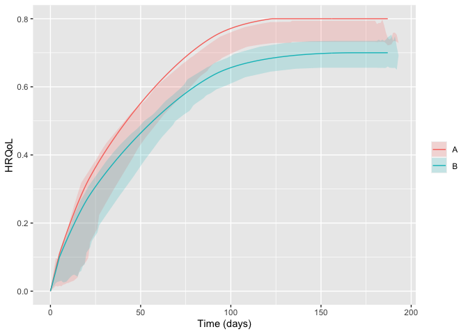

<!-- README.md is generated from README.Rmd. Please edit that file -->

# hrqolr 

<!-- badges: start -->

[](https://github.com/INCEPTdk/hrqolr/actions/workflows/R-CMD-check.yaml)
[](https://app.codecov.io/gh/INCEPTdk/hrqolr)
<!--  -->
<!-- badges: end -->

Package for simulating randomised clinical trials with temporal
trajectories of health-related quality of life (HRQoL) as the outcome,
to quantify effect sizes as single-sampled HRQoL values at end of
follow-up and as the area under the trajectories.

Developed as part of the INCEPT (Intensive Care Platform Trial) project
(<https://incept.dk/>), which is primarily supported by a grant from
Sygeforsikringen “danmark” (<https://www.sygeforsikring.dk/>).

## Resources

- [Website](https://inceptdk.github.io/hrqolr/index.html) - stand-alone
  website with full package documentation
- [Health-related quality of life trajectories in critical illness:
  protocol for a Monte Carlo simulation
  study](https://doi.org/10.1111/aas.14324) - article in Acta
  Anaesthesiologica Scandinavica outlining the first scientific study to
  use `hrqolr`

## Getting started

First, load the package:

``` r
library(hrqolr)
#> Loading 'hrqolr' package v0.0.0.9003.
#> For help, run 'help("hrqolr")' or check out https://inceptdk.github.io/hrqolr/.
#> Consider running 'cache_hrqolr()' for faster simulations. If you have enough RAM, 
#> increasing the cache size might speed up things even more; run '?cache_hrqolr' for details.
```

–then, we activate the cache; although optional, it’s highly
recommended. Here, we choose a cache of max. 2 GB of memory
($2 \cdot 1024^3$ bytes)–`hrqolr` currently only allows in-memory
caching.

``` r
cache_hrqolr(2 * 1024^3)
```

The preferred way to design a scenario is by using the `setup_scenario`
function to validate the input and give it the right format. Set
`verbose = FALSE` to silence the validation results.

``` r
scenario <- setup_scenario(
    arms = c("A", "B"),
    n_patients = 100,
    sampling_frequency = 14,
    index_hrqol = 0.0,
    first_hrqol = 0.1,
    final_hrqol = c(A = 0.8, B = 0.7),
    acceleration_hrqol = c(A = 1.1, B = 1.0),
    
    mortality = 0.4,
    mortality_dampening = 0.0,
    mortality_trajectory_shape = "exp_decay",
    prop_mortality_benefitters = 0.0,
)
#> arms                         valid as is      
#> n_patients                   modified      100 --> c("A" = 100, "B" = 100)   
#> index_hrqol                  modified      0 --> c("A" = 0, "B" = 0)   
#> first_hrqol                  modified      0.1 --> c("A" = 0.1, "B" = 0.1)   
#> final_hrqol                  valid as is      
#> acceleration_hrqol           valid as is      
#> mortality                    modified      0.4 --> c("A" = 0.4, "B" = 0.4)   
#> mortality_dampening          modified      0 --> c("A" = 0, "B" = 0)   
#> mortality_trajectory_shape   modified      "exp_decay" --> c("A" = "exp_decay", "B" = "exp_decay")   
#> prop_mortality_benefitters   modified      0 --> c("A" = 0, "B" = 0)   
#> sampling_frequency           modified      14 --> c("A" = 14, "B" = 14)
```

Getting an overview of the final scenario:

``` r
scenario
#> arms                                    A           B
#> n_patients                            100         100
#> index_hrqol                             0           0
#> first_hrqol                           0.1         0.1
#> final_hrqol                           0.8         0.7
#> acceleration_hrqol                    1.1           1
#> mortality                             0.4         0.4
#> mortality_dampening                     0           0
#> mortality_trajectory_shape      exp_decay   exp_decay
#> prop_mortality_benefitters              0           0
#> sampling_frequency                     14          14
```

With the scenario at hand, we can sample a number of example
trajectories and visualise them:

``` r
example_trajs <- sample_example_trajectories(scenario, n_digits = 3)
plot(example_trajs)
```

<!-- -->

`sample_example_trajectories` returns a `ggplot`, allowing you to
fine-tune its appearance for your needs. For example, breaking apart the
trajectories in the arms apart with facets and hide the legend (remember
to load `ggplot2` first). Here, we also set the arm-level trajectory in
black to make it stand out better:

``` r
library(ggplot2) 

plot(example_trajs, arm_aes = list(colour = "black")) +
    facet_wrap(~ arm) +
    theme(legend.position = "none")
```

<!-- -->

You can also summarise the trajectories, e.g., with inter-quartile
ranges. The ribbons become a bit wonky at end of follow-up due to
increasingly few observations some of which might be low:

``` r
plot(example_trajs, "summarise", ribbon_percentiles = c(0.25, 0.75))
```

<!-- -->

The same scenario specification can, then, be used to simulate a desired
number of trials. By default `hrqolr` will print progress updates to the
console (silence these with `verbose = FALSE`):

``` r
sims <- simulate_trials(scenario)
#> 2023-10-16 14:50:33: Estimating ground truth of arm 'A' (0 secs)
#> 2023-10-16 14:50:33: Building data.table with patients
#> 2023-10-16 14:50:33: Finding unique patients
#> 2023-10-16 14:50:34: Estimating for 675 unique patients
#> 2023-10-16 14:50:35: Assigning results to all (non-unique) patients
#> 2023-10-16 14:50:35: Starting arm 'A' (1.73 secs)
#> 2023-10-16 14:50:35: Building data.table with patients
#> 2023-10-16 14:50:35: Finding unique patients
#> 2023-10-16 14:50:35: Estimating for 3805 unique patients
#> 2023-10-16 14:50:40: Assigning results to all (non-unique) patients
#> 2023-10-16 14:50:40: Estimating ground truth of arm 'B' (6.3 secs)
#> 2023-10-16 14:50:40: Building data.table with patients
#> 2023-10-16 14:50:40: Finding unique patients
#> 2023-10-16 14:50:40: Estimating for 688 unique patients
#> 2023-10-16 14:50:41: Assigning results to all (non-unique) patients
#> 2023-10-16 14:50:42: Starting arm 'B' (1.72 secs)
#> 2023-10-16 14:50:42: Building data.table with patients
#> 2023-10-16 14:50:42: Finding unique patients
#> 2023-10-16 14:50:42: Estimating for 3822 unique patients
#> 2023-10-16 14:50:46: Assigning results to all (non-unique) patients
#> 2023-10-16 14:50:47: Finished (6.79 secs)
#> 2023-10-16 14:50:47: Sampling example trajectories (13.7 secs)
#> 2023-10-16 14:50:47: Wrapping up, returning output (13.84 secs)
```

The returned object contains quite a lot of interesting information. For
example, summary statistics by arm:

``` r
sims$summary_stats
#>                      outcome arm  analysis     p25     p50     p75    mean    sd    se
#>  1:    primary__hrqol_at_eof   A       all   0.459   0.481   0.509   0.484 0.039 0.004
#>  2:    primary__hrqol_at_eof   B       all   0.401   0.422   0.439   0.420 0.032 0.003
#>  3:       primary__hrqol_auc   A       all  67.190  70.537  74.119  70.890 5.627 0.563
#>  4:       primary__hrqol_auc   B       all  57.688  60.434  63.549  60.404 4.739 0.474
#>  5: secondary1__hrqol_at_eof   A       all   0.459   0.481   0.509   0.484 0.039 0.004
#>  6: secondary1__hrqol_at_eof   B       all   0.401   0.422   0.440   0.420 0.032 0.003
#>  7:    secondary1__hrqol_auc   A       all  67.172  70.400  74.010  70.820 5.641 0.564
#>  8:    secondary1__hrqol_auc   B       all  57.405  60.246  63.196  60.192 4.729 0.473
#>  9: secondary2__hrqol_at_eof   A       all   0.459   0.481   0.509   0.484 0.039 0.004
#> 10: secondary2__hrqol_at_eof   B       all   0.401   0.422   0.440   0.420 0.032 0.003
#> 11:    secondary2__hrqol_auc   A       all  62.924  65.823  69.915  66.436 5.297 0.530
#> 12:    secondary2__hrqol_auc   B       all  53.866  56.783  59.309  56.504 4.324 0.432
#> 13:    primary__hrqol_at_eof   A survivors   0.566   0.594   0.616   0.591 0.036 0.004
#> 14:    primary__hrqol_at_eof   B survivors   0.500   0.518   0.534   0.517 0.030 0.003
#> 15:       primary__hrqol_auc   A survivors  82.729  86.936  90.535  86.503 5.428 0.543
#> 16:       primary__hrqol_auc   B survivors  71.606  74.578  77.051  74.448 4.502 0.450
#> 17: secondary1__hrqol_at_eof   A survivors   0.668   0.696   0.708   0.689 0.030 0.003
#> 18: secondary1__hrqol_at_eof   B survivors   0.595   0.614   0.629   0.613 0.027 0.003
#> 19:    secondary1__hrqol_auc   A survivors  97.641 101.795 103.864 100.749 4.479 0.448
#> 20:    secondary1__hrqol_auc   B survivors  84.988  88.201  90.252  87.860 4.061 0.406
#> 21: secondary2__hrqol_at_eof   A survivors   0.779   0.786   0.792   0.785 0.010 0.001
#> 22: secondary2__hrqol_at_eof   B survivors   0.688   0.696   0.702   0.694 0.009 0.001
#> 23:    secondary2__hrqol_auc   A survivors 106.955 107.952 108.581 107.692 1.436 0.144
#> 24:    secondary2__hrqol_auc   B survivors  92.549  93.651  94.309  93.457 1.322 0.132
#>                      outcome arm  analysis     p25     p50     p75    mean    sd    se
```

–and head-to-head comparisons between the arms:

``` r
sims$comparisons
#>                      statistic primary__hrqol_at_eof primary__hrqol_at_eof primary__hrqol_auc primary__hrqol_auc secondary1__hrqol_at_eof secondary1__hrqol_at_eof secondary1__hrqol_auc secondary1__hrqol_auc secondary2__hrqol_at_eof secondary2__hrqol_at_eof secondary2__hrqol_auc secondary2__hrqol_auc
#>  1:                 comparator                     A                     A                  A                  A                        A                        A                     A                     A                        A                        A                     A                     A
#>  2:                     target                     B                     B                  B                  B                        B                        B                     B                     B                        B                        B                     B                     B
#>  3:              mean_estimate                -0.065                -0.074            -10.486            -12.056                   -0.064                   -0.076               -10.628               -12.889                   -0.064                   -0.091                -9.932               -14.234
#>  4:          mean_ground_truth                -0.067                -0.067            -10.834            -10.834                   -0.067                   -0.067                -10.94                -10.94                   -0.067                   -0.067               -10.458               -10.458
#>  5:                         sd                 0.053                 0.049              7.738              7.323                    0.053                    0.044                 7.727                 6.444                    0.053                    0.013                 7.187                 1.847
#>  6:                         se                 0.005                 0.005              0.774              0.732                    0.005                    0.004                 0.773                 0.644                    0.005                    0.001                 0.719                 0.185
#>  7:                   analysis                   all             survivors                all          survivors                      all                survivors                   all             survivors                      all                survivors                   all             survivors
#>  8:                       bias                 0.002                -0.007              0.348             -1.222                    0.002                   -0.009                 0.313                -1.949                    0.002                   -0.024                 0.526                -3.777
#>  9:                    bias_se                 0.005                 0.005              0.774              0.732                    0.005                    0.004                 0.773                 0.644                    0.005                    0.001                 0.719                 0.185
#> 10:              relative_bias                -0.031                 0.105             -0.032              0.113                   -0.033                    0.142                -0.029                 0.178                   -0.033                     0.36                 -0.05                 0.361
#> 11:           relative_bias_se                 0.079                 0.074              0.071              0.068                    0.079                    0.065                 0.071                 0.059                    0.079                     0.02                 0.069                 0.018
#> 12:                        mse                 0.003                 0.002             59.396             54.583                    0.003                    0.002                59.212                44.904                    0.003                    0.001                 51.41                17.643
#> 13:                     mse_se                     0                     0              9.686               8.05                        0                        0                 9.684                 6.374                        0                        0                 8.653                 1.478
#> 14:                   coverage                  0.95                  0.96               0.94               0.95                     0.95                     0.94                  0.94                  0.93                     0.95                     0.48                  0.94                  0.47
#> 15:                coverage_se                 0.022                  0.02              0.024              0.022                    0.022                    0.024                 0.024                 0.026                    0.022                     0.05                 0.024                  0.05
#> 16:    bias_corrected_coverage                  0.94                  0.95               0.92               0.95                     0.94                     0.92                  0.93                  0.93                     0.94                     0.98                  0.94                  0.99
#> 17: bias_corrected_coverage_se                 0.024                 0.022              0.027              0.022                    0.024                    0.027                 0.026                 0.026                    0.024                    0.014                 0.024                  0.01
#> 18:       rejection_proportion                  0.21                  0.29               0.27               0.37                     0.21                     0.45                  0.27                  0.54                     0.21                        1                  0.27                     1
#> 19:    rejection_proportion_se                 0.041                 0.045              0.044              0.048                    0.041                     0.05                 0.044                  0.05                    0.041                        0                 0.044                     0
#> 20:                      n_sim                   100                   100                100                100                      100                      100                   100                   100                      100                      100                   100                   100
#> 21:                        p25                -0.093                -0.107            -14.906            -16.333                   -0.093                     -0.1               -15.055                -16.73                   -0.093                     -0.1               -14.191               -15.778
#> 22:                        p50                -0.059                -0.074            -10.074            -12.096                   -0.059                   -0.075                -9.754               -12.937                   -0.059                    -0.09                -9.267               -14.096
#> 23:                        p75                -0.032                -0.041              -5.76             -6.866                   -0.032                    -0.05                -5.924                -9.444                   -0.032                   -0.081                -5.525               -12.854
#>                      statistic primary__hrqol_at_eof primary__hrqol_at_eof primary__hrqol_auc primary__hrqol_auc secondary1__hrqol_at_eof secondary1__hrqol_at_eof secondary1__hrqol_auc secondary1__hrqol_auc secondary2__hrqol_at_eof secondary2__hrqol_at_eof secondary2__hrqol_auc secondary2__hrqol_auc
```

## Installation

`hrqolr` isn’t on CRAN yet but can be installed from GitHub if you have
the `remotes` package installed:

``` r
# install.packages("remotes") 
remotes::install_github("INCEPTdk/hrqolr")
```

You can also install the **development version** from directly from
GitHub. Doing this requires the *remotes*-package installed. The
development version may contain additional features not yet available in
the stable CRAN version, but may be unstable or lack documentation.

``` r
remotes::install_github("INCEPTdk/hrqolr@dev")
```

## Issues and enhancements

We use the [GitHub issue
tracker](https://github.com/INCEPTdk/hrqolr/issues) for all bug/issue
reports and proposals for enhancements.

## Contributing

We welcome contributions directly to the code to improve performance as
well as new functionality. For the latter, please first explain and
motivate it in an [issue](https://github.com/INCEPTdk/hrqolr/issues).

Changes to the code base should follow these steps:

- [Fork](https://docs.github.com/en/get-started/quickstart/fork-a-repo)
  the repository
- [Make a
  branch](https://docs.github.com/en/pull-requests/collaborating-with-pull-requests/proposing-changes-to-your-work-with-pull-requests/creating-and-deleting-branches-within-your-repository)
  with an appropriate name in your fork
- Implement changes in your fork, make sure it passes R CMD check (with
  neither errors, warnings, nor notes) and add a bullet at the top of
  NEWS.md with a short description of the change, your GitHub handle and
  the id of the pull request implementing the change (check the
  `NEWS.md` file to see the formatting)
- Create a [pull
  request](https://docs.github.com/en/pull-requests/collaborating-with-pull-requests/proposing-changes-to-your-work-with-pull-requests/creating-a-pull-request-from-a-fork)
  into the `dev` branch of `adaptr`

## Citation

If using `hrqolr`, please consider citing it:

``` r
citation(package = "hrqolr")
#> To cite package 'hrqolr' in publications use:
#> 
#>   Kaas-Hansen BS, Granholm A (2023). hrqolr: an R package for
#>   simulating health-related quality of life trajectories.
#>   https://inceptdk.github.io/hrqolr/
#> 
#> A BibTeX entry for LaTeX users is
#> 
#>   @Manual{,
#>     title = {{hrqolr}: an R package for simulating health-related quality of life trajectories},
#>     author = {Benjamin Skov Kaas-Hansen and Anders Granholm},
#>     year = {2023},
#>     url = {https://inceptdk.github.io/hrqolr/},
#>   }
```
