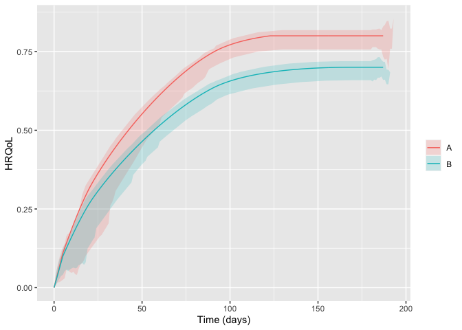

<!-- README.md is generated from README.Rmd. Please edit that file -->

# hrqolr 

<!-- badges: start -->

[](https://github.com/INCEPTdk/hrqolr/actions/workflows/R-CMD-check.yaml)
[](https://app.codecov.io/gh/INCEPTdk/hrqolr)
<!--  -->
<!-- badges: end -->

Package for simulating randomised clinical trials with temporal
trajectories of health-related quality of life (HRQoL) as the outcome,
to quantify effect sizes as single-sampled HRQoL values at end of
follow-up and as the area under the trajectories.

Developed as part of the INCEPT (Intensive Care Platform Trial) project
(<https://incept.dk/>), which is primarily supported by a grant from
Sygeforsikringen “danmark” (<https://www.sygeforsikring.dk/>).

## Resources

- [Website](https://inceptdk.github.io/hrqolr/index.html) - stand-alone
  website with full package documentation
- [Health-related quality of life trajectories in critical illness:
  protocol for a Monte Carlo simulation
  study](https://doi.org/10.1111/aas.14324) - article in Acta
  Anaesthesiologica Scandinavica outlining the first scientific study to
  use `hrqolr`

## Installation

`hrqolr` isn’t on CRAN yet but can be installed from GitHub if you have
the `remotes` package installed:

``` r
# install.packages("remotes") 
remotes::install_github("INCEPTdk/hrqolr")
```

You can also install the **development version** from directly from
GitHub. Doing this requires the *remotes*-package installed. The
development version may contain additional features not yet available in
the stable CRAN version, but may be unstable or lack documentation.

``` r
remotes::install_github("INCEPTdk/hrqolr@dev")
```

## Example

First, load the package:

``` r
library(hrqolr)
#> Loading 'hrqolr' package v0.0.0.9002.
#> For help, run 'help("hrqolr")' or check out https://inceptdk.github.io/hrqolr/.
#> Consider running 'cache_hrqolr()' for faster simulations. If you have enough RAM, 
#> increasing the cache size might speed up things even more; run '?cache_hrqolr' for details.
```

–then, we activate the cache. This is optional but highly recommended.

``` r
cache_hrqolr()
```

`hrqolr` was built to simulate many scenarios, but here we define a
single scenario with the built-in helper `setup_scenario` (note the
validation results printed–silence these with `verbose = FALSE`):

``` r
scenario <- setup_scenario(
    arms = c("A", "B"),
    n_patients = 100,
    sampling_frequency = 14,
    index_hrqol = 0.0,
    first_hrqol = 0.1,
    final_hrqol = c(A = 0.8, B = 0.7),
    acceleration_hrqol = c(A = 0.1, B = 0.0),
    
    mortality = 0.4,
    mortality_dampening = 0.0,
    mortality_trajectory_shape = "exp_decay",
    prop_mortality_benefitters = 0.0,
)
#> arms                         valid as is      
#> n_patients                   modified      100 --> c("A" = 100, "B" = 100)   
#> index_hrqol                  modified      0 --> c("A" = 0, "B" = 0)   
#> first_hrqol                  modified      0.1 --> c("A" = 0.1, "B" = 0.1)   
#> final_hrqol                  valid as is      
#> acceleration_hrqol           valid as is      
#> mortality                    modified      0.4 --> c("A" = 0.4, "B" = 0.4)   
#> mortality_dampening          modified      0 --> c("A" = 0, "B" = 0)   
#> mortality_trajectory_shape   modified      "exp_decay" --> c("A" = "exp_decay", "B" = "exp_decay")   
#> prop_mortality_benefitters   modified      0 --> c("A" = 0, "B" = 0)   
#> sampling_frequency           modified      14 --> c("A" = 14, "B" = 14)
```

Getting an overview of the final scenario:

``` r
scenario
#> arms                                    A           B
#> n_patients                            100         100
#> index_hrqol                             0           0
#> first_hrqol                           0.1         0.1
#> final_hrqol                           0.8         0.7
#> acceleration_hrqol                    0.1           0
#> mortality                             0.4         0.4
#> mortality_dampening                     0           0
#> mortality_trajectory_shape      exp_decay   exp_decay
#> prop_mortality_benefitters              0           0
#> sampling_frequency                     14          14
```

With the scenario at hand, we can sample a number of example
trajectories and visualise them:

``` r
example_trajs <- sample_example_trajectories(scenario, n_digits = 3)
plot(example_trajs)
```

<!-- -->

You might also want to break apart the trajectories in the arms using
well-known `ggplot2` facets (but we need to load `ggplot2` first).
Hiding the legend, then, makes sense as the facet strips will already
provide the same information. Here, we also set the arm-level trajectory
in black to set it apart from the individual patient trajectories:

``` r
library(ggplot2) 

plot(example_trajs, arm_aes = list(colour = "black")) +
    facet_wrap(~ arm) +
    theme(legend.position = "none")
```

<!-- -->

Of course, we might also be interested in summarising the trajectories.
Here, for example, with inter-quartile ranges. Note that the ribbons
become a bit wonky at end of follow-up because there are increasingly
few observations, and some of them may be low because, e.g., *mortality
benefitters* are still alive.

``` r
plot(example_trajs, "summarise", ribbon_percentiles = c(0.25, 0.75))
```

<!-- -->

The same scenario specification can, then, be used to simulate a desired
number of trials. By default `hrqolr` will print progress updates to the
console (hide these with `verbose = FALSE`):

``` r
sims <- simulate_trials(scenario)
#> 2023-10-12 23:27:26: Estimating ground truth of arm A (0 secs)
#> 2023-10-12 23:27:33: Finished arm 'A' in batch (6.9 secs)
#> 2023-10-12 23:27:33: Estimating ground truth of arm B (6.9 secs)
#> 2023-10-12 23:27:40: Finished arm 'B' in batch (6.84 secs)
#> 2023-10-12 23:27:40: Finished batch (7.37 secs)
#> 2023-10-12 23:27:41: Combining data into final return struct (14.4 secs)
#> 2023-10-12 23:27:41: Sampling example trajectories (14.64 secs)
#> 2023-10-12 23:27:41: Wrapping up, returning output (14.78 secs)
```

The `sims` object contains quite a lot of interesting information.
Perhaps the useful are the summary statistics by arm and head-to-head
comparisons between the arms

``` r
sims$summary_stats
#>                      outcome arm  analysis     p25     p50     p75    mean    sd    se
#>  1:    primary__hrqol_at_eof   A       all   0.439   0.467   0.490   0.466 0.038 0.004
#>  2:    primary__hrqol_at_eof   B       all   0.398   0.417   0.435   0.418 0.034 0.003
#>  3:       primary__hrqol_auc   A       all  64.062  68.192  71.859  68.263 5.689 0.569
#>  4:       primary__hrqol_auc   B       all  57.188  60.071  62.805  60.233 4.919 0.492
#>  5: secondary1__hrqol_at_eof   A       all   0.439   0.467   0.490   0.466 0.038 0.004
#>  6: secondary1__hrqol_at_eof   B       all   0.398   0.417   0.435   0.418 0.034 0.003
#>  7:    secondary1__hrqol_auc   A       all  64.115  68.085  71.749  68.177 5.707 0.571
#>  8:    secondary1__hrqol_auc   B       all  56.982  59.643  62.559  60.013 4.911 0.491
#>  9: secondary2__hrqol_at_eof   A       all   0.439   0.467   0.490   0.466 0.038 0.004
#> 10: secondary2__hrqol_at_eof   B       all   0.398   0.417   0.435   0.418 0.034 0.003
#> 11:    secondary2__hrqol_auc   A       all  60.370  64.196  67.171  64.025 5.298 0.530
#> 12:    secondary2__hrqol_auc   B       all  53.668  56.148  58.730  56.292 4.609 0.461
#> 13:    primary__hrqol_at_eof   A survivors   0.547   0.572   0.595   0.572 0.038 0.004
#> 14:    primary__hrqol_at_eof   B survivors   0.487   0.513   0.531   0.512 0.033 0.003
#> 15:       primary__hrqol_auc   A survivors  79.569  83.966  87.275  83.757 5.622 0.562
#> 16:       primary__hrqol_auc   B survivors  70.325  73.733  76.711  73.818 4.788 0.479
#> 17: secondary1__hrqol_at_eof   A survivors   0.654   0.681   0.700   0.678 0.034 0.003
#> 18: secondary1__hrqol_at_eof   B survivors   0.585   0.611   0.628   0.605 0.033 0.003
#> 19:    secondary1__hrqol_auc   A survivors  95.353  99.253 102.825  99.057 5.171 0.517
#> 20:    secondary1__hrqol_auc   B survivors  83.621  87.737  90.290  86.922 4.812 0.481
#> 21: secondary2__hrqol_at_eof   A survivors   0.775   0.785   0.791   0.782 0.012 0.001
#> 22: secondary2__hrqol_at_eof   B survivors   0.688   0.697   0.702   0.695 0.011 0.001
#> 23:    secondary2__hrqol_auc   A survivors 106.407 107.616 108.482 107.330 1.683 0.168
#> 24:    secondary2__hrqol_auc   B survivors  92.553  93.763  94.678  93.614 1.506 0.151
#>                      outcome arm  analysis     p25     p50     p75    mean    sd    se
```

``` r
sims$comparisons
#>                      statistic primary__hrqol_at_eof primary__hrqol_at_eof primary__hrqol_auc primary__hrqol_auc secondary1__hrqol_at_eof secondary1__hrqol_at_eof secondary1__hrqol_auc secondary1__hrqol_auc secondary2__hrqol_at_eof secondary2__hrqol_at_eof secondary2__hrqol_auc secondary2__hrqol_auc
#>  1:                 comparator                     A                     A                  A                  A                        A                        A                     A                     A                        A                        A                     A                     A
#>  2:                     target                     B                     B                  B                  B                        B                        B                     B                     B                        B                        B                     B                     B
#>  3:              mean_estimate                -0.048                 -0.06              -8.03             -9.939                   -0.048                   -0.072                -8.164               -12.135                   -0.048                   -0.086                -7.734               -13.716
#>  4:          mean_ground_truth                -0.063                -0.063             -9.775             -9.775                   -0.063                   -0.063                -9.955                -9.955                   -0.063                   -0.063                -9.763                -9.763
#>  5:                         sd                 0.051                 0.053              7.491              7.786                    0.051                    0.047                 7.494                 6.908                    0.051                    0.018                 7.011                 2.419
#>  6:                         se                 0.005                 0.005              0.749              0.779                    0.005                    0.005                 0.749                 0.691                    0.005                    0.002                 0.701                 0.242
#>  7:                   analysis                   all             survivors                all          survivors                      all                survivors                   all             survivors                      all                survivors                   all             survivors
#>  8:                       bias                 0.014                 0.003              1.745             -0.164                    0.014                   -0.009                 1.791                 -2.18                    0.014                   -0.024                  2.03                -3.953
#>  9:                    bias_se                 0.005                 0.005              0.749              0.779                    0.005                    0.005                 0.749                 0.691                    0.005                    0.002                 0.701                 0.242
#> 10:              relative_bias                -0.228                -0.044             -0.179              0.017                    -0.23                     0.15                 -0.18                 0.219                   -0.231                    0.378                -0.208                 0.405
#> 11:           relative_bias_se                 0.082                 0.085              0.077               0.08                    0.081                    0.074                 0.075                 0.069                    0.081                    0.028                 0.072                 0.025
#> 12:                        mse                 0.003                 0.003             58.605             60.042                    0.003                    0.002                  58.8                52.001                    0.003                    0.001                52.779                21.418
#> 13:                     mse_se                     0                     0              6.969              9.101                        0                        0                 6.977                 7.713                        0                        0                 6.177                 2.068
#> 14:                   coverage                  0.96                  0.96               0.97               0.94                     0.96                     0.93                  0.97                  0.91                     0.96                     0.51                  0.96                  0.47
#> 15:                coverage_se                  0.02                  0.02              0.017              0.024                     0.02                    0.026                 0.017                 0.029                     0.02                     0.05                  0.02                  0.05
#> 16:    bias_corrected_coverage                  0.95                  0.95               0.95               0.95                     0.95                     0.94                  0.95                  0.94                     0.95                     0.93                  0.95                  0.91
#> 17: bias_corrected_coverage_se                 0.022                 0.022              0.022              0.022                    0.022                    0.024                 0.022                 0.024                    0.022                    0.026                 0.022                 0.029
#> 18:       rejection_proportion                  0.16                  0.18               0.19               0.23                     0.16                     0.37                  0.19                  0.46                     0.16                     0.99                  0.19                     1
#> 19:    rejection_proportion_se                 0.037                 0.038              0.039              0.042                    0.037                    0.048                 0.039                  0.05                    0.037                     0.01                 0.039                     0
#> 20:                      n_sim                   100                   100                100                100                      100                      100                   100                   100                      100                      100                   100                   100
#> 21:                        p25                -0.082                -0.092            -12.713            -14.839                   -0.082                   -0.099                -12.67               -16.325                   -0.082                   -0.097               -12.452               -15.141
#> 22:                        p50                -0.045                -0.055             -7.286             -9.731                   -0.045                   -0.071                -7.413               -12.067                   -0.045                   -0.087                -7.195                -13.69
#> 23:                        p75                -0.012                -0.023             -2.844             -4.592                   -0.012                   -0.039                -2.995                -7.739                   -0.012                   -0.074                -2.751               -12.232
#>                      statistic primary__hrqol_at_eof primary__hrqol_at_eof primary__hrqol_auc primary__hrqol_auc secondary1__hrqol_at_eof secondary1__hrqol_at_eof secondary1__hrqol_auc secondary1__hrqol_auc secondary2__hrqol_at_eof secondary2__hrqol_at_eof secondary2__hrqol_auc secondary2__hrqol_auc
```

## Issues and enhancements

We use the [GitHub issue
tracker](https://github.com/INCEPTdk/hrqolr/issues) for all bug/issue
reports and proposals for enhancements.

## Contributing

We welcome contributions directly to the code to improve performance as
well as new functionality. For the latter, please first explain and
motivate it in an [issue](https://github.com/INCEPTdk/hrqolr/issues).

Changes to the code base should follow these steps:

- [Fork](https://docs.github.com/en/get-started/quickstart/fork-a-repo)
  the repository
- [Make a
  branch](https://docs.github.com/en/pull-requests/collaborating-with-pull-requests/proposing-changes-to-your-work-with-pull-requests/creating-and-deleting-branches-within-your-repository)
  with an appropriate name in your fork
- Implement changes in your fork, make sure it passes R CMD check (with
  neither errors, warnings, nor notes) and add a bullet at the top of
  NEWS.md with a short description of the change, your GitHub handle and
  the id of the pull request implementing the change (check the
  `NEWS.md` file to see the formatting)
- Create a [pull
  request](https://docs.github.com/en/pull-requests/collaborating-with-pull-requests/proposing-changes-to-your-work-with-pull-requests/creating-a-pull-request-from-a-fork)
  into the `dev` branch of `adaptr`

## Citation

If using `hrqolr`, please consider citing it:

``` r
citation(package = "hrqolr")
#> To cite package 'hrqolr' in publications use:
#> 
#>   Kaas-Hansen BS, Granholm A (2023). hrqolr: an R package for
#>   simulating health-related quality of life trajectories.
#>   https://inceptdk.github.io/hrqolr/
#> 
#> A BibTeX entry for LaTeX users is
#> 
#>   @Manual{,
#>     title = {{hrqolr}: an R package for simulating health-related quality of life trajectories},
#>     author = {Benjamin Skov Kaas-Hansen and Anders Granholm},
#>     year = {2023},
#>     url = {https://inceptdk.github.io/hrqolr/},
#>   }
```
