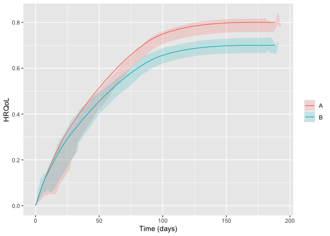

<!-- README.md is generated from README.Rmd. Please edit that file -->

# hrqolr 

<!-- badges: start -->

[](https://github.com/epiben/hrqolr/actions/workflows/R-CMD-check.yaml)
[](https://app.codecov.io/gh/INCEPTdk/hrqolr)
<!--  -->
<!-- badges: end -->

Package for simulating two-arm randomised clinical trials with temporal
trajectories of health-related quality of life (HRQoL) as the outcome
and quantifies effect sizes as single-sampled HRQoL values at end of
follow-up and as the area under the trajectories.

Developed as part of the INCEPT (Intensive Care Platform Trial) project
(<https://incept.dk/>), which is primarily supported by a grant from
Sygeforsikringen “danmark” (<https://www.sygeforsikring.dk/>).

## Resources

- [Website](https://inceptdk.github.io/hrqolr/index.html) - stand-alone
  website with full package documentation
- [Health-related quality of life trajectories in critical illness:
  protocol for a Monte Carlo simulation
  study](https://doi.org/10.1111/aas.14324) - article in Acta
  Anaesthesiologica Scandinavica outlining the first scientific study to
  use `hrqolr`

## Installation

`hrqolr` isn’t on CRAN yet but can be installed from GitHub if you have
the `remotes` package installed:

``` r
# install.packages("remotes") 
remotes::install_github("INCEPTdk/hrqolr")
```

You can also install the **development version** from directly from
GitHub. Doing this requires the *remotes*-package installed. The
development version may contain additional features not yet available in
the stable CRAN version, but may be unstable or lack documentation.

``` r
remotes::install_github("INCEPTdk/hrqolr@dev")
```

## Example

First, load the package:

``` r
library(hrqolr)
#> Loading 'hrqolr' package v0.0.9000.
#> For help, run 'help("hrqolr")' or check out https://inceptdk.github.io/hrqolr/.
#> Consider running 'cache_hrqolr()' for faster simulations. If you have enough RAM, increasing the cache size might speed up things even more; 
#> run '?cache_hrqolr' for details.
```

–then, we activate the cache. This is optional but highly recommended.

``` r
cache_hrqolr()
```

`hrqolr` was built to simulate many scenarios, but here we define a
single scenario and use `do.call` to give the list elements as named
arguments to the function:

``` r
scenario <- list(
    n_trials = 100L,
    n_patients_per_arm = 100L,
    sampling_frequency = 14L,
    n_patients_ground_truth = 1000L,
    n_example_trajectories_per_arm = 100L,
    
    arms = c("A", "B"),
    index_hrqol = c(A = 0.0, B = 0.0),
    first_hrqol = c(A = 0.1, B = 0.1),
    final_hrqol = c(A = 0.8, B = 0.7),
    acceleration_hrqol = c(A = 0.1, B = 0.0),
    
    mortality = c(A = 0.4, B = 0.4),
    mortality_dampening = c(A = 0.0, B = 0.0),
    mortality_trajectory_shape = c(A = "exp_decay", B = "exp_decay"),
    prop_mortality_benefitters = c(A = 0.0, B = 0.0),
    n_digits = 3
)

example_trajs <- do.call(sample_example_trajectories, scenario)
example_trajs
#> $arm_level
#>      arm          x         y
#>   1:   A   0.000000 0.0000000
#>   2:   A   5.000000 0.1100000
#>   3:   A   5.006211 0.1100609
#>   4:   A   5.017999 0.1102155
#>   5:   A   5.035294 0.1104622
#>  ---                         
#> 594:   B 186.604774 0.7000000
#> 595:   B 186.762172 0.7000000
#> 596:   B 186.880937 0.7000000
#> 597:   B 186.960426 0.7000000
#> 598:   B 187.000000 0.7000000
#> 
#> $patient_level
#>       arm  id   x         y
#>    1:   A   1   0 0.0000000
#>    2:   A   1   9 0.1210000
#>    3:   A   1  10 0.0000000
#>    4:   A   2   0 0.0000000
#>    5:   A   2  50 0.0820000
#>   ---                      
#> 2252:   B 200 133 0.7223143
#> 2253:   B 200 147 0.7280000
#> 2254:   B 200 161 0.7310000
#> 2255:   B 200 175 0.7310000
#> 2256:   B 200 189 0.7310000
#> 
#> attr(,"class")
#> [1] "hrqolr_trajectories" "list"
```

### Visualise trajectories

``` r
plot(example_trajs)
```


You might also want to break apart the trajectories in the arms. Hiding
the legend, then, makes sense as the facet strips will already provide
the same information. Here, we also set the arm-level trajectory in
black to set it apart from the individual patient trajectories:

``` r
library(ggplot2) 

plot(example_trajs, arm_aes = list(colour = "black")) +
    facet_wrap(~ arm) +
    theme(legend.position = "none")
```



Of course, we might also be interested in summarising the trajectories.
Here, for example, with inter-quartile ranges. Note that the ribbons
become a bit wonky at end of follow-up because there are increasingly
few observations, and some of them may be low because, e.g., *mortality
benefitters* are still alive.

``` r
plot(example_trajs, "summarise", ribbon_percentiles = c(0.25, 0.75))
```


The same scenario specification can, then, be used to simulate a desired
number of trials:

``` r
sims <- do.call(simulate_trials, scenario)
#> 2023-10-04 15:16:35: Estimating ground truth of arm A (0 secs)
#> 2023-10-04 15:16:48: Finished arm 'A' in batch (13.12 secs)
#> 2023-10-04 15:16:48: Estimating ground truth of arm B (13.12 secs)
#> 2023-10-04 15:17:01: Finished arm 'B' in batch (12.59 secs)
#> 2023-10-04 15:17:01: Finished batch (12.89 secs)
#> 2023-10-04 15:17:01: Combining data into final return struct (26.17 secs)
#> 2023-10-04 15:17:01: Wrapping up, returning output (26.2 secs)
sims
#> $summary_stats
#>                      outcome arm  analysis         p25         p50         p75
#>  1:    primary__hrqol_at_eof   A       all   0.4545150   0.4755350   0.4976625
#>  2:    primary__hrqol_at_eof   B       all   0.3945425   0.4183150   0.4411500
#>  3:       primary__hrqol_auc   A       all  66.3712879  69.6579439  72.7747194
#>  4:       primary__hrqol_auc   B       all  56.7253300  60.5214887  63.3352651
#>  5: secondary1__hrqol_at_eof   A       all   0.4545150   0.4755350   0.4976625
#>  6: secondary1__hrqol_at_eof   B       all   0.3952650   0.4183150   0.4411500
#>  7:    secondary1__hrqol_auc   A       all  66.3337672  69.5726049  72.7028925
#>  8:    secondary1__hrqol_auc   B       all  56.6950110  60.3027054  63.2218979
#>  9: secondary2__hrqol_at_eof   A       all   0.4545150   0.4755350   0.4976625
#> 10: secondary2__hrqol_at_eof   B       all   0.3952650   0.4183150   0.4411500
#> 11:    secondary2__hrqol_auc   A       all  62.3874079  65.2913302  68.1377208
#> 12:    secondary2__hrqol_auc   B       all  53.1958311  56.4383943  59.4447974
#> 13:    primary__hrqol_at_eof   A survivors   0.5600473   0.5840513   0.6082282
#> 14:    primary__hrqol_at_eof   B survivors   0.4885596   0.5106373   0.5340828
#> 15:       primary__hrqol_auc   A survivors  82.1101393  85.3571708  89.2243108
#> 16:       primary__hrqol_auc   B survivors  70.3347862  73.7634297  77.0674439
#> 17: secondary1__hrqol_at_eof   A survivors   0.6596208   0.6860463   0.7071192
#> 18: secondary1__hrqol_at_eof   B survivors   0.5881867   0.6071097   0.6259293
#> 19:    secondary1__hrqol_auc   A survivors  96.5894743 100.5117371 102.8966477
#> 20:    secondary1__hrqol_auc   B survivors  84.5784544  87.1273619  90.2613489
#> 21: secondary2__hrqol_at_eof   A survivors   0.7758056   0.7846061   0.7922107
#> 22: secondary2__hrqol_at_eof   B survivors   0.6889943   0.6959494   0.7015797
#> 23:    secondary2__hrqol_auc   A survivors 106.5290293 107.5943341 108.5483765
#> 24:    secondary2__hrqol_auc   B survivors  92.8010617  93.7169985  94.5147982
#>                      outcome arm  analysis         p25         p50         p75
#>            mean          sd           se
#>  1:   0.4757633 0.033922731 0.0033922731
#>  2:   0.4156550 0.035100797 0.0035100797
#>  3:  69.6804500 4.949652678 0.4949652678
#>  4:  59.9142122 4.997006133 0.4997006133
#>  5:   0.4760869 0.033855927 0.0033855927
#>  6:   0.4159338 0.035238449 0.0035238449
#>  7:  69.6316306 4.947023786 0.4947023786
#>  8:  59.7486650 5.029279108 0.5029279108
#>  9:   0.4760869 0.033855927 0.0033855927
#> 10:   0.4159338 0.035238449 0.0035238449
#> 11:  65.2738004 4.633036904 0.4633036904
#> 12:  56.0319007 4.733978947 0.4733978947
#> 13:   0.5844709 0.034916038 0.0034916038
#> 14:   0.5118941 0.035819467 0.0035819467
#> 15:  85.6050894 5.150381886 0.5150381886
#> 16:  73.7888922 5.108277033 0.5108277033
#> 17:   0.6828919 0.032447747 0.0032447747
#> 18:   0.6072027 0.028211609 0.0028211609
#> 19:  99.8836155 4.850081013 0.4850081013
#> 20:  87.2285342 4.063915778 0.4063915778
#> 21:   0.7834906 0.011557565 0.0011557565
#> 22:   0.6948380 0.009294728 0.0009294728
#> 23: 107.4226576 1.657530848 0.1657530848
#> 24:  93.6059112 1.302426009 0.1302426009
#>            mean          sd           se
#> 
#> $comparisons
#>                     outcome        mean mean_ground_truth         sd
#> 1:    primary__hrqol_at_eof  -0.0601083         -0.077066 0.05247630
#> 2:       primary__hrqol_auc -11.8161973        -14.389573 7.62188493
#> 3: secondary1__hrqol_at_eof  -0.0601531         -0.077066 0.05238591
#> 4:    secondary1__hrqol_auc -12.6550813        -15.024230 6.10626065
#> 5: secondary2__hrqol_at_eof  -0.0601531         -0.077066 0.05238591
#> 6:    secondary2__hrqol_auc -13.8167464        -13.076459 1.91552865
#>             se  analysis comparator target       bias     bias_se relative_bias
#> 1: 0.005247630       all          A      B  0.0169577 0.005247630   -0.22004126
#> 2: 0.762188493 survivors          A      B  2.5733754 0.762188493   -0.17883613
#> 3: 0.005238591       all          A      B  0.0169129 0.005238591   -0.21945994
#> 4: 0.610626065 survivors          A      B  2.3691489 0.610626065   -0.15768854
#> 5: 0.005238591       all          A      B  0.0169129 0.005238591   -0.21945994
#> 6: 0.191552865 survivors          A      B -0.7402870 0.191552865    0.05661219
#>    relative_bias_se          mse       mse_se coverage coverage_se
#> 1:       0.06809267  0.003013788 0.0004480764     0.94  0.02374868
#> 2:       0.05296811 64.134459638 9.0517072872     0.93  0.02551470
#> 3:       0.06797539  0.003002887 0.0004521019     0.94  0.02374868
#> 4:       0.04064275 42.526421575 5.8198356812     0.96  0.01959592
#> 5:       0.06797539  0.003002887 0.0004521019     0.94  0.02374868
#> 6:       0.01464868  4.180582305 0.6382570299     0.96  0.01959592
#>    bias_corrected_coverage bias_corrected_coverage_se rejection_proportion
#> 1:                    0.94                 0.02374868                 0.22
#> 2:                    0.93                 0.02551470                 0.34
#> 3:                    0.93                 0.02551470                 0.22
#> 4:                    0.97                 0.01705872                 0.50
#> 5:                    0.93                 0.02551470                 0.22
#> 6:                    0.97                 0.01705872                 0.99
#>    rejection_proportion_se n_sim         p25       p50        p75
#> 1:             0.041424630   100  -0.0936775  -0.05713  -0.023330
#> 2:             0.047370877   100 -17.2428597 -11.42719  -6.922696
#> 3:             0.041424630   100  -0.0936775  -0.05713  -0.024570
#> 4:             0.050000000   100 -16.2669058 -13.18206  -8.144643
#> 5:             0.041424630   100  -0.0936775  -0.05713  -0.024570
#> 6:             0.009949874   100 -15.0271941 -13.84674 -12.683173
#> 
#> $args
#> $args$n_trials
#> [1] 100
#> 
#> $args$n_patients_per_arm
#> [1] 100
#> 
#> $args$sampling_frequency
#> [1] 14
#> 
#> $args$n_patients_ground_truth
#> [1] 1000
#> 
#> $args$n_example_trajectories_per_arm
#> [1] 100
#> 
#> $args$arms
#> [1] "A" "B"
#> 
#> $args$index_hrqol
#> A B 
#> 0 0 
#> 
#> $args$first_hrqol
#>   A   B 
#> 0.1 0.1 
#> 
#> $args$final_hrqol
#>   A   B 
#> 0.8 0.7 
#> 
#> $args$acceleration_hrqol
#>   A   B 
#> 0.1 0.0 
#> 
#> $args$mortality
#>   A   B 
#> 0.4 0.4 
#> 
#> $args$mortality_dampening
#> A B 
#> 0 0 
#> 
#> $args$mortality_trajectory_shape
#>           A           B 
#> "exp_decay" "exp_decay" 
#> 
#> $args$prop_mortality_benefitters
#> A B 
#> 0 0 
#> 
#> $args$test_fun
#> welch_t_test
#> 
#> $args$verbose
#> [1] TRUE
#> 
#> $args$n_digits
#> [1] 3
#> 
#> $args$seed
#> [1] -1508126091
#> 
#> $args$valid_hrqol_range
#> c(-0.757, 1)
#> 
#> $args$alpha
#> [1] 0.05
#> 
#> 
#> $example_trajectories
#> $arm_level
#>      arm          x         y
#>   1:   A   0.000000 0.0000000
#>   2:   A   5.000000 0.1100000
#>   3:   A   5.006211 0.1100609
#>   4:   A   5.017999 0.1102155
#>   5:   A   5.035294 0.1104622
#>  ---                         
#> 594:   B 186.604774 0.7000000
#> 595:   B 186.762172 0.7000000
#> 596:   B 186.880937 0.7000000
#> 597:   B 186.960426 0.7000000
#> 598:   B 187.000000 0.7000000
#> 
#> $patient_level
#>       arm  id   x         y
#>    1:   A   1   0 0.0000000
#>    2:   A   1  10 0.1230000
#>    3:   A   1  24 0.2803429
#>    4:   A   1  38 0.4094467
#>    5:   A   1  52 0.5276908
#>   ---                      
#> 2049:   B 200 127 0.6598121
#> 2050:   B 200 141 0.6680000
#> 2051:   B 200 155 0.6730000
#> 2052:   B 200 169 0.6750000
#> 2053:   B 200 183 0.6750000
#> 
#> attr(,"class")
#> [1] "hrqolr_trajectories" "list"               
#> 
#> $elapsed_time
#> Time difference of 26.49287 secs
#> 
#> attr(,"class")
#> [1] "hrqolr_results" "list"
```

## Issues and enhancements

We use the [GitHub issue
tracker](https://github.com/epiben/hrqolr/issues) for all bug/issue
reports and proposals for enhancements.

## Contributing

We welcome contributions directly to the code to improve performance as
well as new functionality. For the latter, please first explain and
motivate it in an [issue](https://github.com/epiben/hrqolr/issues).

Changes to the code base should follow these steps:

- [Fork](https://docs.github.com/en/get-started/quickstart/fork-a-repo)
  the repository
- [Make a
  branch](https://docs.github.com/en/pull-requests/collaborating-with-pull-requests/proposing-changes-to-your-work-with-pull-requests/creating-and-deleting-branches-within-your-repository)
  with an appropriate name in your fork
- Implement changes in your fork, make sure it passes R CMD check (with
  neither errors, warnings, nor notes) and add a bullet at the top of
  NEWS.md with a short description of the change, your GitHub handle and
  the id of the pull request implementing the change (check the
  `NEWS.md` file to see the formatting)
- Create a [pull
  request](https://docs.github.com/en/pull-requests/collaborating-with-pull-requests/proposing-changes-to-your-work-with-pull-requests/creating-a-pull-request-from-a-fork)
  into the `dev` branch of `adaptr`

## Citation

If using `hrqolr`, please consider citing it:

``` r
citation(package = "hrqolr")
#> To cite package 'hrqolr' in publications use:
#> 
#>   Kaas-Hansen BS, Jensen AKG, Granholm A (2023). hrqolr: an R package
#>   for simulating health-related quality of life trajectories.
#>   https://inceptdk.github.io/hrqolr/
#> 
#> A BibTeX entry for LaTeX users is
#> 
#>   @Manual{,
#>     title = {{hrqolr}: an R package for simulating health-related quality of life trajectories},
#>     author = {Benjamin Skov Kaas-Hansen and Aksel Karl Georg Jensen and Anders Granholm},
#>     year = {2023},
#>     url = {https://inceptdk.github.io/hrqolr/},
#>   }
```
